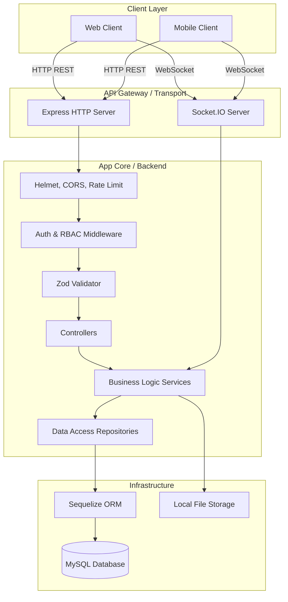
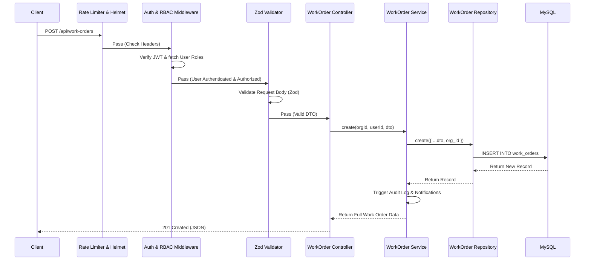
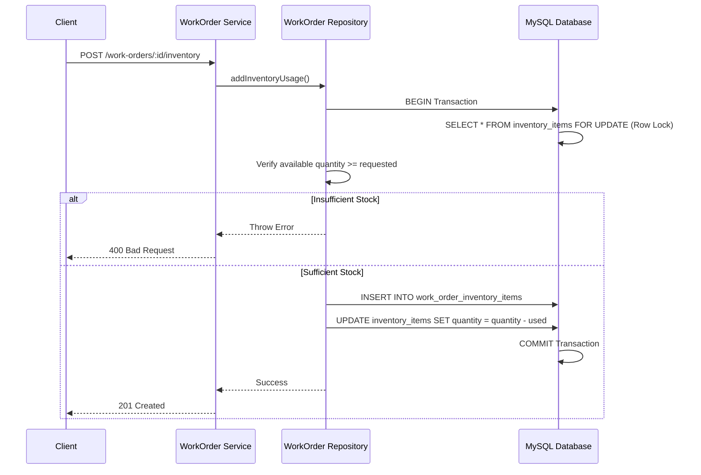
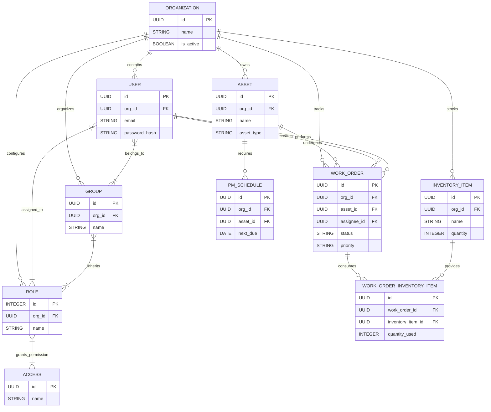
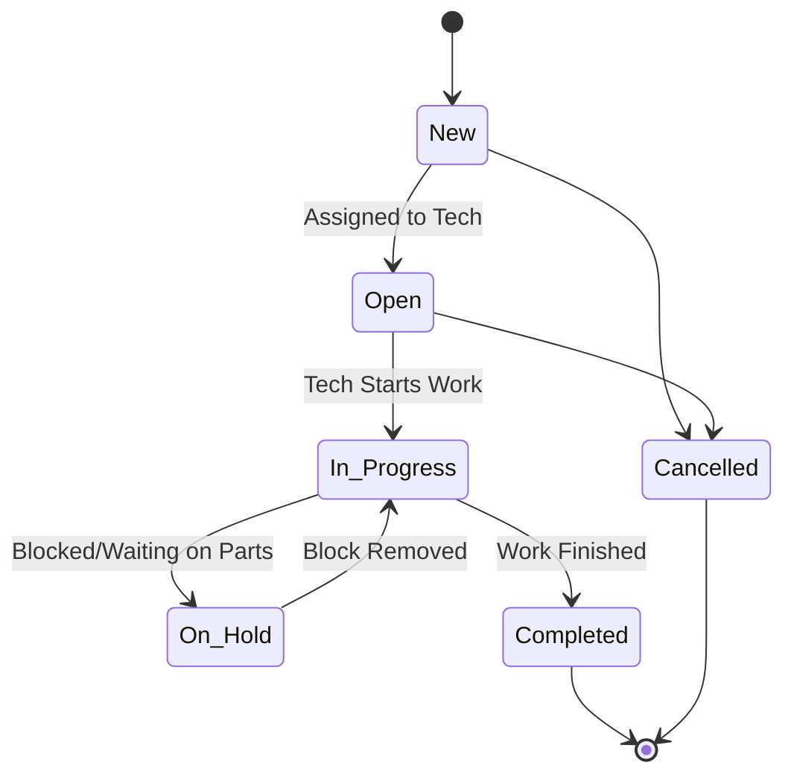
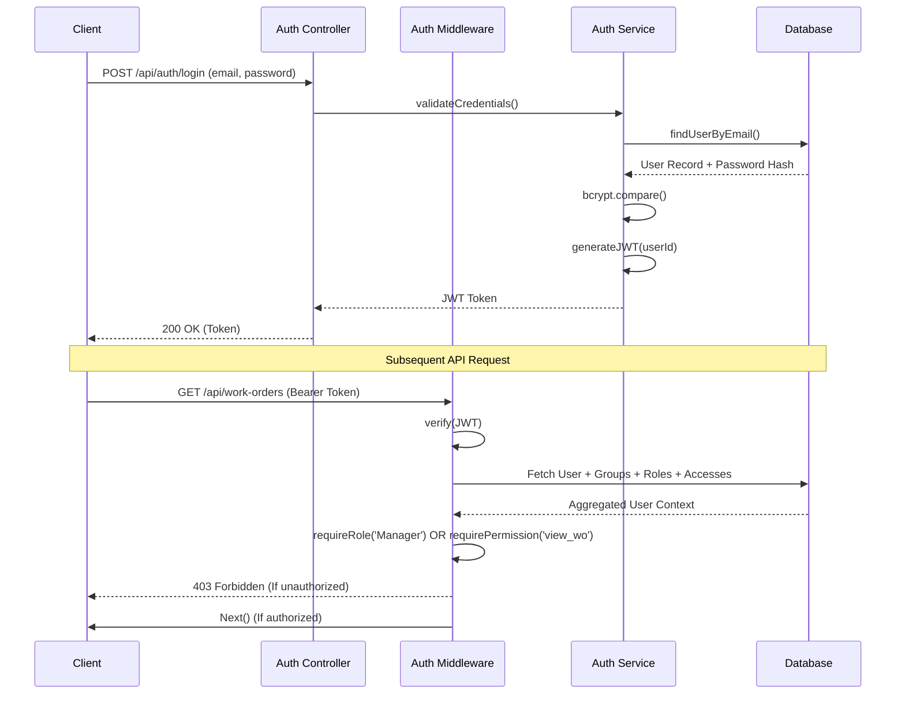
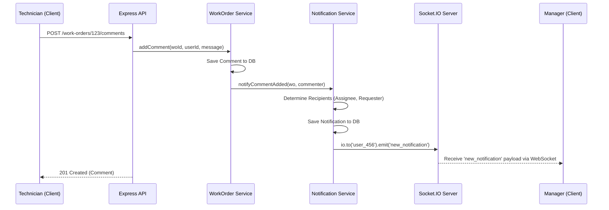

# CMMS Backend Platform - Technical Design & Architecture

## 1. Executive Summary

This system is a **B2B Enterprise Computerized Maintenance Management System (CMMS)** designed to help organizations manage their maintenance operations, assets, inventory, and workforces. 

Built as a multi-tenant SaaS application, its primary capabilities include:
- **Work Order Management:** Creating, assigning, tracking, and updating maintenance jobs.
- **Asset Management:** Tracking movable and immovable equipment, warrantees, and service histories.
- **Inventory Management:** Monitoring spare parts, stock levels, and tying usage directly to work orders.
- **Preventive Maintenance (PM):** Scheduling recurring maintenance tasks.
- **Real-time Collaboration:** Granular role-based access control (RBAC), commenting on work orders, and real-time push notifications via WebSockets.
- **Analytics:** Providing data-driven insights through dashboard summaries for technicians and managers.

---

## 2. High-Level Architecture

The application is built as a **Modular Monolith** using the traditional **N-Tier (Layered) Architecture**.

### Core Layers:
1. **Transport / API Layer:** Express.js and Socket.IO handle HTTP requests and WebSocket connections.
2. **Middleware Layer:** Handles cross-cutting concerns (authentication, role verification, payload validation, security headers).
3. **Controller Layer:** Extracts HTTP payloads, delegates to services, and shapes the HTTP response.
4. **Service Layer (Business Logic):** Contains all domain rules, orchestrates operations across multiple data domains, and delegates database operations.
5. **Repository / Data Access Layer:** Abstracts direct database interactions using the Sequelize ORM.
6. **Data Layer:** A relational MySQL database.

---

## 3. Project Structure Breakdown

The codebase is organized by technical responsibility within the `src/` directory, following standard Node.js/TypeScript conventions.

| Directory | Purpose | Key Files / Modules |
| :--- | :--- | :--- |
| `src/models/` | Defines the Sequelize ORM models, DB schema definitions, and table associations. | `index.ts` (contains all DB relationships) |
| `src/routes/` | Defines API endpoints and attaches middleware and controllers. | `workOrders.ts`, `auth.ts`, `index.ts` |
| `src/controllers/` | Parses `req`/`res`, extracts user context, calls services. | `workOrder.controller.ts`, `analytics.controller.ts` |
| `src/services/` | Core business logic, domain rules, orchestrating DB calls. | `workOrder.service.ts`, `notification.service.ts` |
| `src/repositories/` | Abstracts DB queries. Enforces multi-tenancy (`org_id`). | `workOrder.repository.ts`, `user.repository.ts` |
| `src/middleware/` | Intercepts requests for Auth, Logging, Validation, Errors. | `auth.ts`, `validate.ts`, `errorHandler.ts` |
| `src/validators/` | Zod schemas for strict request payload validation. | `workOrder.validator.ts`, `auth.validator.ts` |
| `src/config/` | Application bootstrapping configurations. | `database.ts`, `logger.ts` (Pino) |
| `src/errors/` | Custom Application error classes for clean error propagation. | `AppError.ts` |
| `src/constants/` | Hardcoded configuration lists and role definitions. | `roles.ts` |
| `src/types/` | TypeScript interfaces, DTOs, and global type extensions. | `dto.ts`, `express.d.ts` |

---

## 4. Request Lifecycle / Flow

When a client makes an API request, it passes through a strict, predictable pipeline.

### Example: Creating a Work Order

### Example: Safe Inventory Usage (Atomic Transaction)

---

## 5. API Design Overview

The system uses a strictly RESTful architecture. It communicates exclusively over JSON. 

- **Versioning:** API routes are mapped under `/api/` (with initial traces of `/api/v1/`).
- **Validation:** Uses strict `Zod` schemas. Invalid requests automatically fail at the middleware layer, returning a `400 Bad Request` with structured field-level errors.
- **Error Responses:** Standardized format mapping to standard HTTP status codes (`401`, `403`, `404`, `409`, `500`).

### Core Endpoints

| Resource | Endpoints | Purpose |
| :--- | :--- | :--- |
| **Auth** | `POST /auth/login` | Authenticate and retrieve JWT token. |
| **Users / Roles** | `GET, POST, PUT, DELETE /users` | Manage workforce, groups, roles, and granular accesses. |
| **Assets** | `GET, POST, PUT, DELETE /assets` | Manage physical equipment and locations. |
| **Work Orders** | `GET, POST, PUT, DELETE /work-orders` | Core CMMS resource. |
| | `PATCH /work-orders/:id/status` | Advance WO lifecycle state. |
| | `POST /work-orders/:id/comments` | Add a comment & trigger a WS notification. |
| | `POST /work-orders/:id/inventory` | Deduct spare parts from inventory to complete work. |
| **Inventory** | `GET, POST, PUT, DELETE /inventory` | Manage stock levels and unit costs. |
| **PM Schedules**| `GET, POST, PUT, DELETE /pm-schedules`| Configure recurring maintenance routines. |
| **Analytics** | `GET /analytics/dashboard` | Fetch aggregated counts and metrics for managers. |

---

## 6. Database Design

The database uses a relational model via **MySQL**, completely abstracted behind **Sequelize ORM**. It enforces multi-tenancy strictly by using an `org_id` foreign key on almost all tables. Data uses a "Soft Delete" pattern (`paranoid: true` in Sequelize, using a `deleted_at` column) to prevent accidental data loss.

### Entity Relationship Diagram

---

## 7. Core Business Logic

The heavy lifting of the application occurs inside the **Service Layer**:

- **Work Order Management (`workOrder.service.ts`):** 
  - Validates transitions between statuses (`new` -> `in_progress` -> `completed`).
  - Manages atomic transactions when attaching inventory to a work order. If an item is added to a work order, the inventory's total stock quantity is securely deducted.
  - Automatically delegates to the `auditService` to log user actions, and the `notificationService` to ping assignees.

### Work Order Lifecycle (State Flow)

- **Analytics Engine (`analytics.service.ts`):**
  - Aggregates data by querying specific views/counts in the DB.
  - Generates specialized dashboards based on the user's role (Manager vs. Technician).
- **Notification Routing (`notification.service.ts`):**
  - Maps database events (like a new comment) to Socket.IO user rooms (`user_123`) for real-time delivery without blocking the main HTTP thread.

---

## 8. Authentication & Authorization

The system features an advanced, multi-layered Role-Based Access Control (RBAC) architecture.

1. **Authentication (`jwt`):** Login generates a stateless JWT. The secret is securely stored in `.env`.
2. **Context Resolution (`auth.ts` middleware):** On every request, the `user` is fetched alongside their assigned `Roles`, `Groups`, and inherited `Accesses` (permissions).
3. **Effective Roles:** A user's total permission scope is a merged array of Direct Roles + Roles inherited from their Groups.

---

## 9. Error Handling Strategy

The system utilizes a central error handler to prevent unexpected app crashes and standardize API outputs.

1. **Domain Errors (`AppError.ts`):** 
   - Code logic throws custom exceptions: `NotFoundError`, `BadRequestError`, `ForbiddenError`, `ConflictError`.
2. **Global Catcher (`errorHandler.ts`):** 
   - Intercepts all thrown exceptions.
   - Maps `AppError` instances to their respective HTTP codes (`400`, `404`, `401`).
   - Normalizes third-party errors (e.g., mapping `SequelizeUniqueConstraintError` to `400`).
   - Ensures `500` server errors do not leak stack traces to the client in production.
   - Logs the failure via Pino, tying it to a specific `req.id`.

---

## 10. External Integrations (Real-time & Storage)

### WebSocket Push Notification Flow
Uses `Socket.IO` attached directly to the Express `httpServer`. Connects authenticated clients to private `user_id` and `work_order_id` rooms to broadcast targeted events.

**File Storage:** Uses `Multer` to handle file uploads locally (`/uploads` directory). Work order attachments and images are saved straight to the host machine's disk.

---

## 11. Configuration & Environment

Environment variables configure the infrastructure dependencies:
- Loaded dynamically via `dotenv`.
- **Database:** `DB_HOST`, `DB_PORT`, `DB_USER`, `DB_PASS`, `DB_NAME`.
- **Security:** `JWT_SECRET` (critical for signing auth tokens).
- **Application:** `PORT` (default 8000), `LOG_LEVEL` (default 'info').

---

## 12. Design Patterns Used

- **MVC / N-Tier Architecture:** The project separates routing, controllers, models, and business services cleanly.
- **Repository Pattern:** `src/repositories/` abstracts the underlying Sequelize syntax, allowing services to retrieve business objects rather than writing ORM queries directly.
- **Dependency Injection (Light):** Controllers consume instantiated Singleton services (`const workOrderService = new WorkOrderService();`).
- **Middleware Pattern:** Express middleware chains heavily used for request enrichment, validation, and early termination.
- **Pub/Sub (Event-Driven):** Implemented on the frontend interaction layer via Socket.IO rooms.

---

## 13. Performance & Scalability

**Current Strengths:**
- Database queries use Sequelize associations effectively to prevent N+1 queries.
- Pagination is implemented on list endpoints (`limit`, `skip`).
- Connection pooling is enabled via Sequelize (max 20 connections per instance).
- API is protected against DDoS and brute force via `express-rate-limit` (15 login attempts per 15 mins).

**Scalability Bottlenecks:**
1. **Stateful WebSockets:** Socket.IO stores active connections in memory (`activeSockets = new Map()`). If the backend scales horizontally (multiple instances behind a Load Balancer), websockets will fail to broadcast across nodes.
2. **Local File Storage:** `multer` uploads to local disk. In a multi-node deployment, uploaded files will only exist on the node that handled the request, leading to missing attachments.

---

## 14. Security Analysis

- **Strengths:** 
  - Standardized JWT authentication.
  - Deep RBAC and multi-tenant data isolation (`org_id` strict enforcement).
  - Uses `Helmet` for secure HTTP headers.
  - Passwords are securely hashed with `bcryptjs`.
  - Input validation via `Zod` prevents NoSQL/SQL injection and mass assignment vulnerabilities.
- **Potential Weaknesses:**
  - JWTs are stateless and cannot be forcibly revoked before expiry. If a user is deactivated, their token remains valid until it expires.
  - No explicit request origin checking (CORS is set to `origin: '*'` in Socket.IO and likely broad in Express), which can open the door to CSRF or cross-origin hijacking.

---

## 15. Observability

The application ensures observability via:
- **Structured Logging:** Uses `Pino` logger. Outputs human-readable logs in development (`pino-pretty`) and strict JSON logs in production for ingestion by tools like Datadog or ELK.
- **Request Tracing:** A `requestLogger` middleware assigns a UUID to every incoming HTTP request, allowing log aggregators to trace a request end-to-end.
- **Health Checks:** A robust `/health` endpoint checks memory usage, uptime, and pings the database connection (`sequelize.authenticate()`), allowing an orchestration system (e.g., Kubernetes, AWS ALB) to monitor node health.

---

## 16. Deployment Architecture (Assumed)

Based on the structure and configurations, the expected deployment model is:
- **Runtime:** Node.js v18+.
- **Process Manager:** Ran natively using `node dist/server.js` or via PM2. 
- **Database:** Managed MySQL instance (e.g., AWS RDS, Google Cloud SQL).
- **Proxy:** Expected to run behind an Nginx Reverse Proxy or an Application Load Balancer (ALB) to handle HTTPS termination and route traffic to port `8000`.

---

## 17. Improvement Recommendations

For the application to reach absolute enterprise production-readiness, consider the following technical improvements:

1. **Cloud File Storage Migration:** Migrate `Multer` to use an `aws-sdk` S3 storage engine. This resolves the local filesystem bottleneck and enables horizontal scaling.
2. **Socket.IO Redis Adapter:** Introduce the `@socket.io/redis-adapter` so that multiple instances of the backend can synchronize WebSocket events via a Redis pub/sub backplane.
3. **JWT Blacklisting / Revocation:** Implement a Redis-backed token blacklist to immediately revoke sessions upon password reset or role demotion.
4. **Preventive Maintenance Cron Job:** The current PM schedule logic generates data when called via API. A dedicated background worker (e.g., using `node-cron` or `BullMQ`) is necessary to actively read the `next_due` dates on `pm_schedules` and autonomously generate Work Orders.
5. **Tighten CORS:** Restrict the `cors()` middleware and Socket.IO origin to explicit production URLs.