# CMMS-Platform Backend — Architectural Workflow Documentation

> **Generated**: March 2026  
> **Application**: Computerized Maintenance Management System (CMMS)  
> **Stack**: Node.js · Express 5 · TypeScript · Sequelize · MySQL · Socket.IO  

---

## Table of Contents

1. [Codebase Understanding](#step-1--codebase-understanding)
2. [System Components](#step-2--system-components)
3. [API & Entry Points](#step-3--api--entry-points)
4. [Workflow Identification](#step-4--workflow-identification)
5. [Sequence Diagrams](#step-5--sequence-diagrams)

---

## STEP 1 — Codebase Understanding

### 1.1 Architecture Style

**Modular Monolith** — A single Express process that organizes code by feature-domain (assets, work orders, inventory, etc.) within a layered folder structure. There is no separate service layer; business logic is colocated inside Express route handlers. Real-time features are powered by Socket.IO running on the same HTTP server.

```
backend/
├── src/
│   ├── server.ts               # Application entry & Socket.IO setup
│   ├── config/
│   │   └── database.ts         # Sequelize configuration (MySQL)
│   ├── middleware/
│   │   ├── auth.ts             # JWT authentication & RBAC middleware
│   │   └── errorHandler.ts     # Centralized error handling
│   ├── models/
│   │   └── index.ts            # All 12 Sequelize models + associations
│   └── routes/
│       ├── index.ts            # Route aggregator (mounts all sub-routers)
│       ├── auth.ts             # Login / session
│       ├── users.ts            # User management (CRUD + bulk)
│       ├── organizations.ts    # Multi-tenant org management
│       ├── roles.ts            # RBAC role management
│       ├── assets.ts           # Asset registry (CRUD + bulk)
│       ├── workOrders.ts       # Work orders, comments, parts, attachments
│       ├── pmSchedules.ts      # Preventive maintenance schedules
│       ├── inventory.ts        # Spare parts / inventory (CRUD + bulk)
│       └── analytics.ts        # Dashboard & technician analytics
├── seed.ts                     # DB seeding (org, roles, demo users)
├── uploads/                    # File upload storage (work order attachments)
├── .env                        # Environment configuration
├── package.json
└── tsconfig.json
```

### 1.2 Main Layers

| Layer | Location | Description |
|---|---|---|
| **API / Controllers** | `src/routes/*.ts` | Express routers with inline request handling. Each route file acts as both controller and service. |
| **Business Logic** | Inlined in route handlers | Validation, authorization checks, stock management, notification dispatch — all within route callbacks. |
| **Data Access / ORM** | `src/models/index.ts` | 12 Sequelize model classes with associations. Direct `Model.findAll()`, `Model.create()`, etc. calls from routes. |
| **Middleware** | `src/middleware/` | Cross-cutting: JWT auth (`authenticate`), RBAC (`requireRole`), and error handling (`errorHandler`, `AppError`). |
| **Infrastructure** | `src/config/database.ts`, `src/server.ts` | Sequelize + MySQL connection, Express app bootstrap, Socket.IO server, static file serving. |
| **Real-time** | `src/server.ts` (Socket.IO) | WebSocket connections for live comments and notification delivery. |

### 1.3 Frameworks & Technologies

| Technology | Version | Purpose |
|---|---|---|
| **Node.js** | (runtime) | Server runtime |
| **Express** | 5.2.x | HTTP framework |
| **TypeScript** | 5.9.x | Static typing |
| **Sequelize** | 6.37.x | ORM (MySQL dialect) |
| **MySQL** | via `mysql2` 3.18.x | Relational database |
| **Socket.IO** | 4.8.x | Real-time WebSocket communication |
| **jsonwebtoken** | 9.0.x | JWT creation & verification |
| **bcryptjs** | 3.0.x | Password hashing |
| **multer** | 2.1.x | Multipart file upload handling |
| **dotenv** | 17.3.x | Environment variable management |
| **cors** | 2.8.x | Cross-origin resource sharing |
| **nodemon** | 3.1.x (dev) | Hot-reload during development |
| **ts-node** | 10.9.x (dev) | TypeScript execution without build |

### 1.4 Dependency Injection

**None** — There is no DI container. Dependencies (models, middleware) are imported directly via ES module `import` statements. The Socket.IO `io` instance is shared via `app.set('io', io)` and accessed in routes via `req.app.get('io')`.

### 1.5 Configuration Management

- **Environment**: Variables loaded via `dotenv` from `.env` file
- **Keys**: `PORT`, `DB_HOST`, `DB_PORT`, `DB_USER`, `DB_PASSWORD`, `DB_NAME`, `JWT_SECRET`
- **Fallbacks**: Hardcoded defaults for DB config and JWT secret in code

### 1.6 Logging / Monitoring

- **Console-based only**: `console.log()` / `console.error()` throughout
- Socket.IO connections/disconnections are logged
- Error stack traces are printed in the global error handler
- **No structured logging** (no Winston, Pino, etc.)
- **No APM or metrics** instrumentation

### 1.7 Error Handling

```
Route Handler → try/catch → next(err) → Global Error Handler
```

- **`AppError`** class in `errorHandler.ts`: Custom error with `statusCode`
- **Sequelize-specific**: `SequelizeValidationError` and `SequelizeUniqueConstraintError` are caught and returned as **400** responses
- **Global handler** in `server.ts`: Catches any unhandled errors and returns `{ detail: message }` with appropriate status code
- **Multer errors**: Caught inline in the attachment upload route

### 1.8 Multi-Tenancy

The application uses **single-database, shared-schema multi-tenancy**:
- Every data model includes an `org_id` field
- All queries filter by the authenticated user's `org_id` (`req.user.org_id`)
- Organization isolation is enforced at the query level, not the database level

### 1.9 Soft Delete Strategy

All major models use Sequelize's `paranoid: true` mode:
- First delete → sets `deleted_at` timestamp + `is_active = false` (soft delete)
- Second delete on already-soft-deleted record → `force: true` (hard delete / permanent)
- Listing endpoints support `record_status=inactive` query param to show soft-deleted records

---

## STEP 2 — System Components

### 2.1 Core Modules

| Module | File(s) | Responsibility |
|---|---|---|
| **Authentication** | `routes/auth.ts`, `middleware/auth.ts` | Login, JWT issuance, session validation, RBAC |
| **User Management** | `routes/users.ts` | CRUD + bulk-delete, password hashing, role assignment |
| **Organization** | `routes/organizations.ts` | Org creation with default roles, org lookup |
| **Role Management** | `routes/roles.ts` | CRUD for roles, system role protection |
| **Asset Registry** | `routes/assets.ts` | Asset CRUD + bulk operations, auto-generated asset tags |
| **Work Orders** | `routes/workOrders.ts` | Full lifecycle management, assignment, status transitions |
| **WO Comments** | `routes/workOrders.ts` (sub-routes) | Threaded comments with real-time Socket.IO broadcast |
| **WO Inventory** | `routes/workOrders.ts` (sub-routes) | Parts consumption tracking with stock deduction/restoration |
| **WO Attachments** | `routes/workOrders.ts` (sub-routes) | File upload (images) via Multer |
| **PM Schedules** | `routes/pmSchedules.ts` | Preventive maintenance scheduling tied to assets |
| **Inventory** | `routes/inventory.ts` | Spare parts management, low-stock detection, category listing |
| **Analytics** | `routes/analytics.ts` | Dashboard statistics, technician-specific views |
| **Audit Logging** | Cross-cutting (in routes) | Records create/update/delete actions to `audit_logs` table |
| **Notifications** | In `workOrders.ts` + `server.ts` | In-app notifications with real-time Socket.IO delivery |

### 2.2 Data Model (12 Sequelize Models)

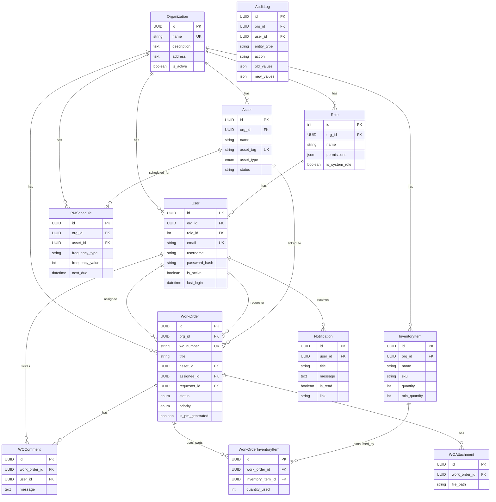

### 2.3 System Component Diagram

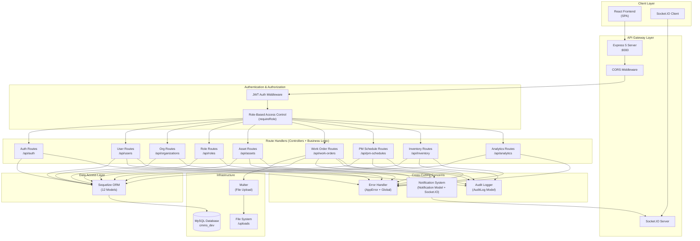

### 2.4 External Systems & Integrations

| System | Type | Notes |
|---|---|---|
| **MySQL Database** | Persistence | Primary data store, connected via Sequelize |
| **File System** | Storage | Work order attachments stored locally in `/uploads/work-orders/` |
| **None (External APIs)** | — | No third-party API integrations exist currently |

> **Note**: There are no message queues, background job processors, cron schedulers, or external notification providers (email, SMS, push) in the current implementation.

---

## STEP 3 — API & Entry Points

### 3.1 REST API Endpoints

All routes are mounted under `/api` prefix. Authentication is required unless noted.

#### Authentication (`/api/auth` & `/api/v1/auth`)

| Method | Endpoint | Auth? | Roles | Description |
|---|---|---|---|---|
| `POST` | `/auth/login` | No | Any | User login, returns JWT + user object |
| `GET` | `/auth/me` | Yes | Any | Get current user profile with role |

#### User Management (`/api/users`)

| Method | Endpoint | Auth? | Roles | Description |
|---|---|---|---|---|
| `GET` | `/users` | Yes | Any | List org users (supports `record_status`, pagination) |
| `POST` | `/users` | Yes | Super_Admin, Org_Admin, Admin | Create new user with role assignment |
| `GET` | `/users/:user_id` | Yes | Any | Get single user by ID |
| `PUT` | `/users/:user_id` | Yes | Super_Admin, Org_Admin, Admin | Update user (profile, role, password) |
| `DELETE` | `/users/:user_id` | Yes | Super_Admin, Org_Admin, Admin | Soft/hard delete user |
| `POST` | `/users/bulk-delete` | Yes | Super_Admin, Org_Admin, Admin | Bulk deactivate/delete users |

#### Organizations (`/api/organizations`)

| Method | Endpoint | Auth? | Roles | Description |
|---|---|---|---|---|
| `POST` | `/organizations` | No | Any | Create organization + default roles |
| `GET` | `/organizations` | Yes | Super_Admin | List all organizations |
| `GET` | `/organizations/:org_id` | Yes | Super_Admin or own org | Get organization details |

#### Roles (`/api/roles`)

| Method | Endpoint | Auth? | Roles | Description |
|---|---|---|---|---|
| `GET` | `/roles` | Yes | Any | List active roles for org |
| `POST` | `/roles` | Yes | Super_Admin, Org_Admin | Create new custom role |
| `PUT` | `/roles/:role_id` | Yes | Super_Admin, Org_Admin | Update role (system roles blocked) |

#### Assets (`/api/assets`)

| Method | Endpoint | Auth? | Roles | Description |
|---|---|---|---|---|
| `GET` | `/assets` | Yes | Any | List assets (search, filter, pagination) |
| `POST` | `/assets` | Yes | Super_Admin, Org_Admin, Facility_Manager | Create asset |
| `POST` | `/assets/bulk` | Yes | Super_Admin, Org_Admin, Facility_Manager | Bulk create assets |
| `GET` | `/assets/:asset_id` | Yes | Any | Get single asset |
| `PUT` | `/assets/:asset_id` | Yes | Super_Admin, Org_Admin, Facility_Manager | Update asset |
| `DELETE` | `/assets/:asset_id` | Yes | Any | Soft/hard delete asset |
| `POST` | `/assets/bulk-delete` | Yes | Super_Admin, Org_Admin, Facility_Manager | Bulk delete assets |

#### Work Orders (`/api/work-orders`)

| Method | Endpoint | Auth? | Roles | Description |
|---|---|---|---|---|
| `GET` | `/work-orders` | Yes | Any (filtered by role) | List work orders with includes |
| `POST` | `/work-orders` | Yes | Most roles | Create work order |
| `GET` | `/work-orders/:wo_id` | Yes | Any | Get single work order (full load) |
| `PUT` | `/work-orders/:wo_id` | Yes | Any | Update work order |
| `PATCH` | `/work-orders/:wo_id/status` | Yes | Any | Change work order status |
| `PATCH` | `/work-orders/:wo_id/assign` | Yes | Super_Admin, Org_Admin, Facility_Manager | Assign technician |
| `DELETE` | `/work-orders/:wo_id` | Yes | Super_Admin, Org_Admin, Facility_Manager | Soft/hard delete |
| `POST` | `/work-orders/bulk-delete` | Yes | Super_Admin, Org_Admin, Facility_Manager | Bulk delete work orders |
| `GET` | `/work-orders/:wo_id/comments` | Yes | Any | List WO comments |
| `POST` | `/work-orders/:wo_id/comments` | Yes | Any | Add comment (+ real-time notification) |
| `GET` | `/work-orders/:wo_id/inventory` | Yes | Any | List parts used |
| `POST` | `/work-orders/:wo_id/inventory` | Yes | Any | Add part (deducts stock) |
| `DELETE` | `/work-orders/:wo_id/inventory/:usage_id` | Yes | Any | Remove part (restores stock) |
| `POST` | `/work-orders/:wo_id/attachments` | Yes | Any | Upload images (max 3, 1MB each) |

#### PM Schedules (`/api/pm-schedules`)

| Method | Endpoint | Auth? | Roles | Description |
|---|---|---|---|---|
| `GET` | `/pm-schedules` | Yes | Any | List PM schedules |
| `POST` | `/pm-schedules` | Yes | Super_Admin, Org_Admin, Facility_Manager | Create PM schedule |
| `GET` | `/pm-schedules/:pm_id` | Yes | Any | Get single PM schedule |
| `PUT` | `/pm-schedules/:pm_id` | Yes | Super_Admin, Org_Admin, Facility_Manager | Update PM schedule |
| `DELETE` | `/pm-schedules/:pm_id` | Yes | Super_Admin, Org_Admin, Facility_Manager | Deactivate PM schedule |

#### Inventory (`/api/inventory`)

| Method | Endpoint | Auth? | Roles | Description |
|---|---|---|---|---|
| `GET` | `/inventory` | Yes | Any | List inventory items (search, filter, pagination) |
| `GET` | `/inventory/stats` | Yes | Any | Inventory statistics (totals, low stock, value) |
| `GET` | `/inventory/categories` | Yes | Any | List distinct categories |
| `POST` | `/inventory` | Yes | Super_Admin, Org_Admin, Facility_Manager | Create inventory item |
| `GET` | `/inventory/:item_id` | Yes | Any | Get single item |
| `PUT` | `/inventory/:item_id` | Yes | Super_Admin, Org_Admin, Facility_Manager | Update item |
| `DELETE` | `/inventory/:item_id` | Yes | Super_Admin, Org_Admin, Facility_Manager | Soft/hard delete |
| `POST` | `/inventory/bulk-delete` | Yes | Super_Admin, Org_Admin, Facility_Manager | Bulk delete items |

#### Analytics (`/api/analytics`)

| Method | Endpoint | Auth? | Roles | Description |
|---|---|---|---|---|
| `GET` | `/analytics/dashboard` | Yes | Any | Organization-wide dashboard stats |
| `GET` | `/analytics/technician-dashboard` | Yes | Any | Technician-specific performance stats |

### 3.2 Health Check

| Method | Endpoint | Auth? | Description |
|---|---|---|---|
| `GET` | `/health` | No | Returns `{ status: "ok" }` |

### 3.3 WebSocket Events (Socket.IO)

| Event | Direction | Description |
|---|---|---|
| `connection` | Client → Server | Authenticates via JWT in handshake, registers active socket |
| `join_wo_room` | Client → Server | Client joins `wo_{id}` room for real-time WO updates |
| `leave_wo_room` | Client → Server | Client leaves a WO room |
| `disconnect` | Client → Server | Cleans up active socket mapping |
| `new_comment` | Server → Room | Broadcasts new comment to all users viewing a work order |
| `new_notification` | Server → All | Broadcasts notification (client filters by `target_user_id`) |

### 3.4 CLI Tasks

| Script | Command | Description |
|---|---|---|
| **Seed** | `npm run seed` → `ts-node seed.ts` | Creates default org, 5 system roles, 5 demo users |
| **DB Sync** | `ts-node sync_db.ts` (manual) | Forces schema synchronization |

### 3.5 Static File Serving

| Path | Description |
|---|---|
| `/uploads/*` | Serves uploaded work order attachment files |

---

## STEP 4 — Workflow Identification

### 4.1 User Authentication (Login)

**Flow**: `POST /api/auth/login`

```
Client → AuthRoute.login()
  → User.findOne({ email }, include: [Role, Organization])
  → bcrypt.compareSync(password, user.password_hash)
  → Validate user.is_active
  → Update user.last_login
  → jwt.sign({ sub, org_id, role })
  → Return { access_token, user }
```

### 4.2 Organization Registration

**Flow**: `POST /api/organizations`

```
Client → OrgRoute.create()
  → Organization.findOne({ name }) — duplication check
  → Organization.create({ name, description, address })
  → Create 5 default roles (Super_Admin, Org_Admin, Facility_Manager, Technician, Requestor)
  → Return organization
```

### 4.3 User Creation

**Flow**: `POST /api/users`

```
Client → authenticate() → requireRole([Admin+])
  → UserRoute.create()
  → User.findOne({ email }) — duplication check
  → Role.findOne({ id, org_id }) — validate role exists
  → Check requestor permissions (Admins cannot assign Super_Admin/Org_Admin)
  → bcrypt.hashSync(password)
  → User.create({ org_id, role_id, email, ... })
  → User.findByPk(include: [Role]) — reload with association
  → AuditLog.create({ entity_type: 'User', action: 'create' })
  → Return 201 + created user
```

### 4.4 Work Order Lifecycle

**Flow**: Full lifecycle from creation to completion

```
1. CREATE: POST /api/work-orders
   → authenticate() → requireRole(*)
   → Generate wo_number (WO-YYYYMMDD-XXXX)
   → WorkOrder.create({ org_id, requester_id, status: 'new' })
   → AuditLog.create()

2. ASSIGN: PATCH /api/work-orders/:id/assign
   → authenticate() → requireRole([Manager+])
   → WorkOrder.update({ assignee_id, status: 'open' })
   → AuditLog.create()

3. START: PATCH /api/work-orders/:id/status { status: 'in_progress' }
   → authenticate()
   → Set actual_start timestamp
   → AuditLog.create()

4. ADD PARTS: POST /api/work-orders/:id/inventory
   → authenticate()
   → InventoryItem.findOne() — validate stock
   → Deduct item.quantity
   → WorkOrderInventoryItem.create()

5. UPLOAD PROOF: POST /api/work-orders/:id/attachments
   → authenticate()
   → Multer saves files to /uploads/work-orders/
   → WOAttachment.create() for each file

6. COMPLETE: PATCH /api/work-orders/:id/status { status: 'completed' }
   → authenticate()
   → Validate at least 1 attachment exists (gate)
   → Set actual_end timestamp
   → AuditLog.create()
```

### 4.5 Work Order Comments & Notifications

**Flow**: `POST /api/work-orders/:wo_id/comments`

```
Client → authenticate()
  → WorkOrder.findOne() — verify access
  → WOComment.create({ work_order_id, user_id, message })
  → WOComment.findByPk(include: [User, Role]) — full load
  → io.to('wo_<id>').emit('new_comment', comment) — real-time broadcast
  → Determine recipients (assignee + requester, excluding commenter)
  → For each recipient:
      → Notification.create({ user_id, title, message, link })
      → io.emit('new_notification', { ...notification, target_user_id })
  → Return 201 + comment
```

### 4.6 Inventory Management

**Flow**: CRUD + Stock consumption

```
CREATE: POST /api/inventory
  → authenticate() → requireRole([Manager+])
  → InventoryItem.create({ org_id, ... })
  → AuditLog.create()

CONSUME (via WO): POST /api/work-orders/:id/inventory
  → Validate stock availability
  → Deduct InventoryItem.quantity
  → Create WorkOrderInventoryItem usage record

RESTORE (via WO): DELETE /api/work-orders/:id/inventory/:usage_id
  → Find usage record
  → Restore InventoryItem.quantity
  → Destroy usage record

LOW STOCK: GET /api/inventory?low_stock_only=true
  → Where min_quantity > 0 AND quantity <= min_quantity
```

### 4.7 Asset Lifecycle

**Flow**: Registration → Usage → Deactivation

```
CREATE: POST /api/assets
  → Auto-generate asset_tag (AST-XXXXXX) if not provided
  → Asset.create({ org_id, ... })
  → AuditLog.create()

LINK TO WO: POST /api/work-orders { asset_id: <id> }
  → Work order references asset

DEACTIVATE: DELETE /api/assets/:id (first call)
  → Set is_active = false + soft delete (deleted_at timestamp)

PERMANENT DELETE: DELETE /api/assets/:id (second call on soft-deleted)
  → force: true — permanently removes record
```

### 4.8 Analytics Dashboard

**Flow**: `GET /api/analytics/dashboard`

```
Client → authenticate()
  → Count work orders by status (new, open, in_progress, on_hold, completed, cancelled)
  → Count by priority (low, medium, high, critical)
  → Calculate completion rate
  → Count active assets
  → Count active PM schedules + overdue PMs
  → Fetch 10 most recent work orders (with Asset, Assignee, Requester)
  → Return aggregated stats object
```

### 4.9 Preventive Maintenance Schedule

**Flow**: CRUD (no auto-generation logic currently)

```
CREATE: POST /api/pm-schedules
  → authenticate() → requireRole([Manager+])
  → PMSchedule.create({ org_id, asset_id, frequency_type, frequency_value, next_due })
  → AuditLog.create()

NOTE: The PM → WO auto-generation is modeled (is_pm_generated flag on WorkOrder)
      but not yet implemented as a background scheduler.
```

### 4.10 RBAC Authorization Matrix

| Role | Users | Assets | Work Orders | Inventory | PM Schedules | Analytics | Roles | Orgs |
|---|---|---|---|---|---|---|---|---|
| **Super_Admin** | Full CRUD | Full CRUD | Full CRUD | Full CRUD | Full CRUD | Full | Full CRUD | Full |
| **Org_Admin** | Full CRUD | Full CRUD | Full CRUD | Full CRUD | Full CRUD | Full | Full CRUD | Own org |
| **Facility_Manager** | Read | Full CRUD | Full CRUD | Full CRUD | Full CRUD | Full | Read | — |
| **Technician** | Read | Read | Own assigned | Read | Read | Own stats | Read | — |
| **Requestor** | Read | Read | Own requested | Read | Read | Read | Read | — |

---

## STEP 5 — Sequence Diagrams

### 5.1 User Login

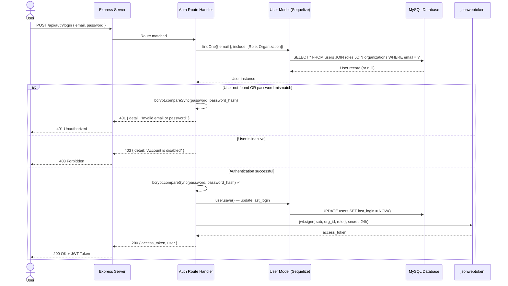

### 5.2 Work Order Creation

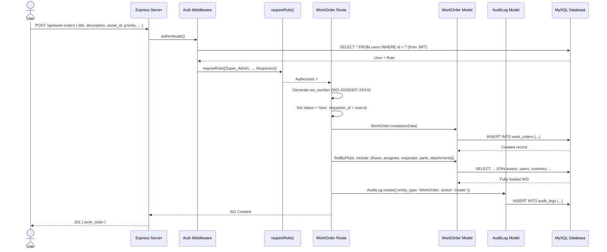

### 5.3 Work Order Comment + Real-Time Notification

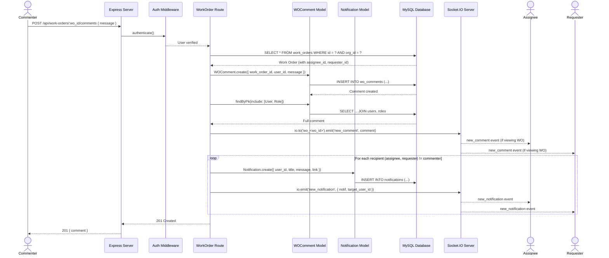

### 5.4 Work Order Status Transition (Completion Gate)

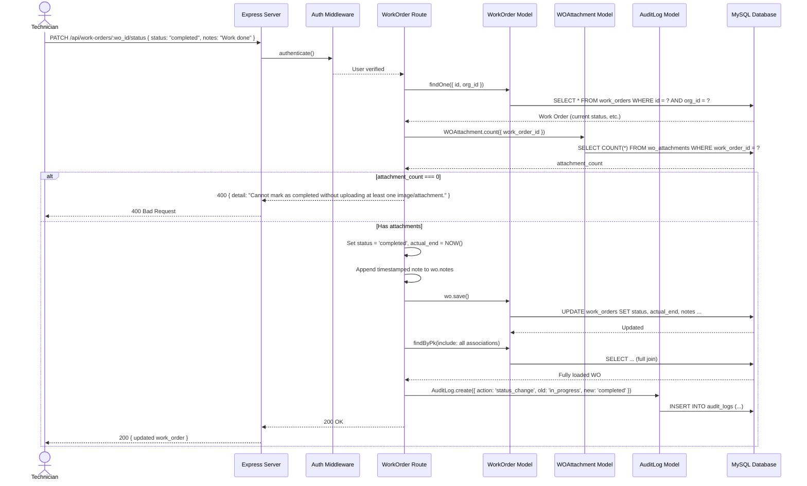

### 5.5 Inventory Consumption via Work Order

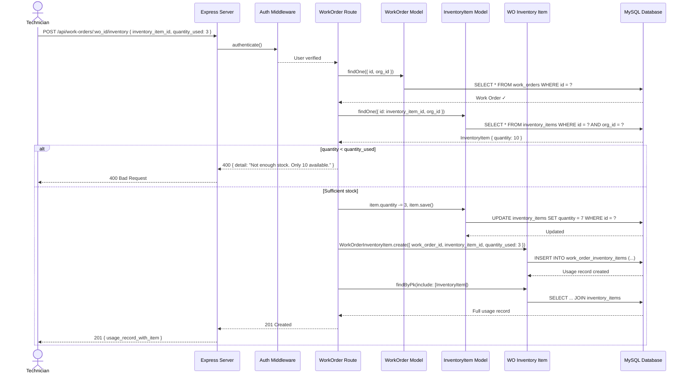

### 5.6 Organization Setup + User Registration

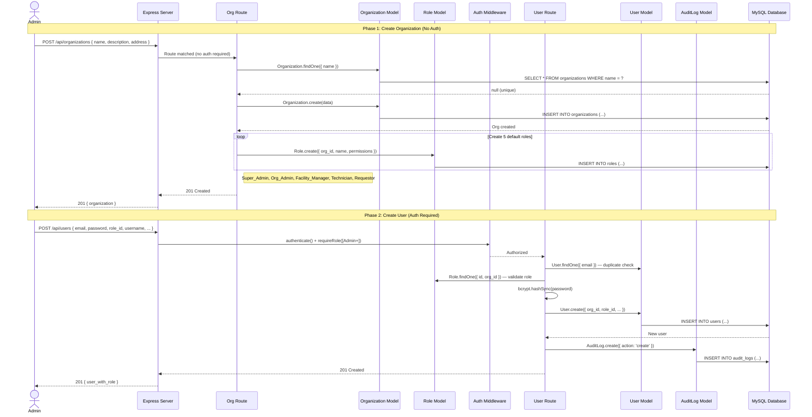

### 5.7 Work Order Assignment

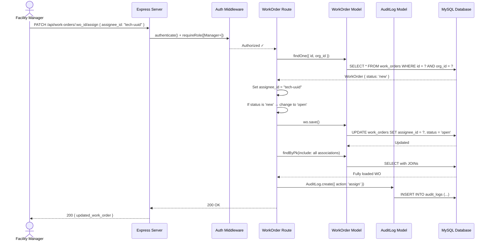

### 5.8 File Upload (Work Order Attachments)

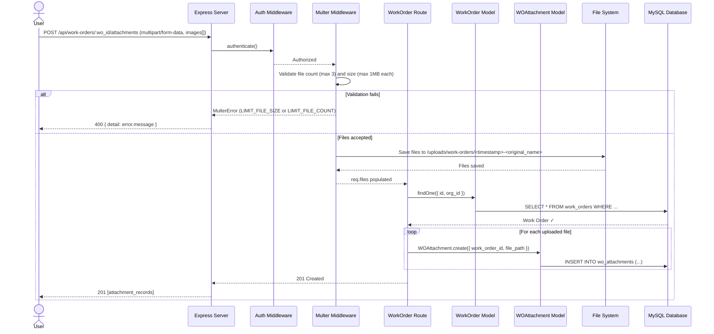

### 5.9 Analytics Dashboard

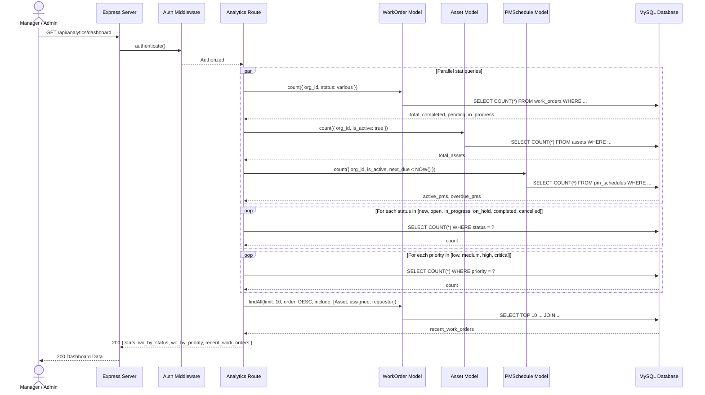

### 5.10 Soft Delete / Hard Delete Flow (Universal Pattern)

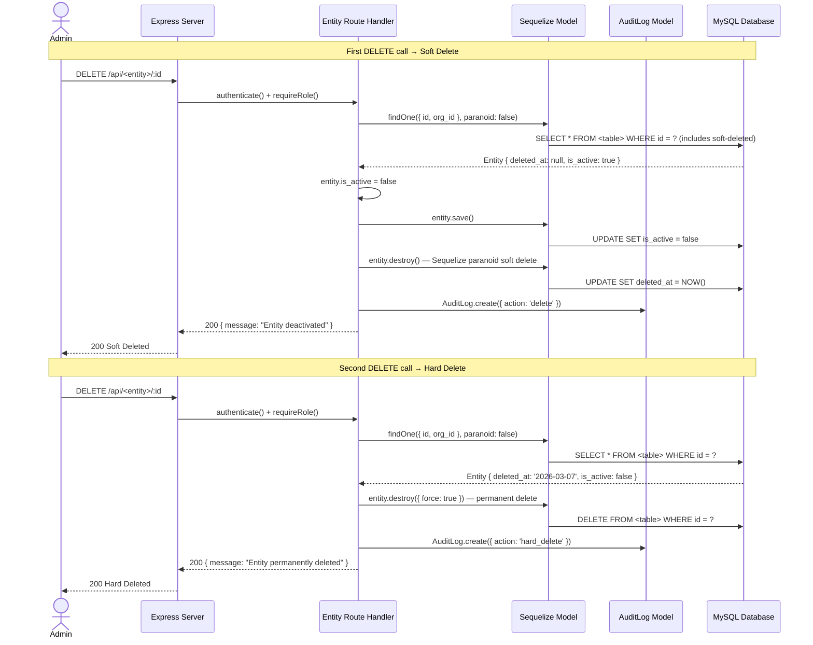

---

## Appendix A — Request Flow Summary

Every authenticated API request follows this pipeline:

```
Client HTTP Request
    │
    ▼
┌──────────────────────┐
│   CORS Middleware     │
└──────────┬───────────┘
           │
    ▼
┌──────────────────────┐
│   express.json()     │  ← Body parsing
└──────────┬───────────┘
           │
    ▼
┌──────────────────────┐
│  authenticate()      │  ← JWT verification + User lookup
│  middleware/auth.ts   │
└──────────┬───────────┘
           │
    ▼
┌──────────────────────┐
│  requireRole([...])  │  ← RBAC check (optional per route)
│  middleware/auth.ts   │
└──────────┬───────────┘
           │
    ▼
┌──────────────────────┐
│  Route Handler        │  ← Business logic + Sequelize queries
│  routes/<module>.ts   │
└──────────┬───────────┘
           │
    ▼
┌──────────────────────┐     ┌─────────────────┐
│  Sequelize ORM       │────▶│  MySQL Database  │
│  models/index.ts     │◀────│                  │
└──────────┬───────────┘     └─────────────────┘
           │
    ▼ (on error)
┌──────────────────────┐
│  Global Error Handler │  ← Catches all unhandled errors
│  server.ts            │
└──────────────────────┘
```

## Appendix B — Work Order State Machine

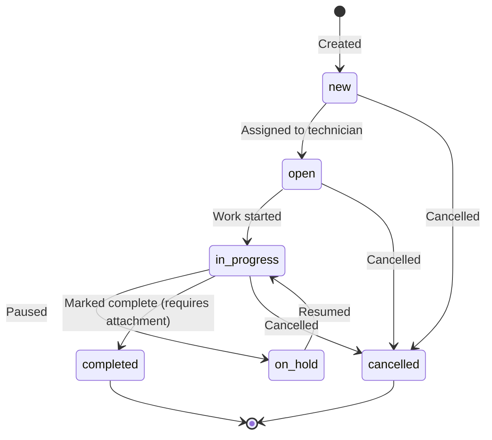

## Appendix C — Technology Decision Summary

| Decision | Choice | Rationale |
|---|---|---|
| Runtime | Node.js + TypeScript | Rapid development, type safety |
| Web Framework | Express 5 | Industry standard, mature ecosystem |
| ORM | Sequelize 6 | Feature-rich, MySQL support, migrations, paranoid mode |
| Database | MySQL | Relational data with strong FK constraints |
| Auth | JWT (24h expiry) | Stateless auth, no session store needed |
| Real-time | Socket.IO | Bidirectional events for comments/notifications |
| File Storage | Local disk (Multer) | Simple, no cloud dependency for MVP |
| Password Hashing | bcryptjs | Industry standard, salt rounds = 10 |
| Multi-tenancy | Shared DB, `org_id` filter | Simple, effective for single-deployment |
