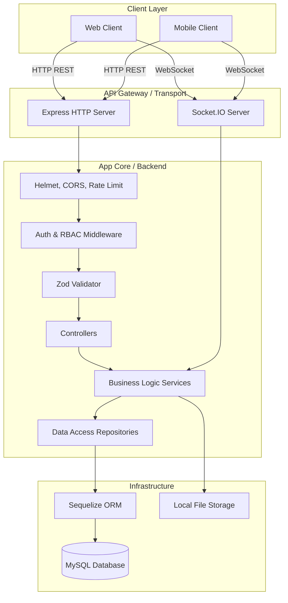
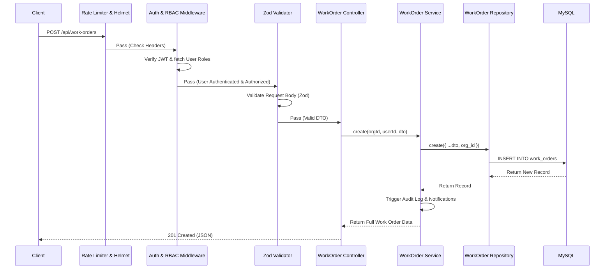

# CMMS Platform - Backend Developer Manual

This manual provides a deep dive into the backend architecture, security models (RBAC), and development patterns of the CMMS Platform.

---

## 1. High-Level Architecture

The backend is built as a **Modular Monolith** using a **Layered (N-Tier) Architecture** in Node.js/TypeScript.

### Core Layers:
1.  **Transport / API Layer**: Express.js handles REST endpoints; Socket.IO manages real-time events.
2.  **Middleware Layer**: Cross-cutting concerns like Auth, RBAC, Validation (Zod), and Security (Helmet).
3.  **Controller Layer**: Handles HTTP req/res, extracts DTOs, and calls services.
4.  **Service Layer**: **Crucial Layer.** Contains all business logic, domain rules, and orchestrates cross-domain operations.
5.  **Repository Layer**: Abstracts Sequelize ORM queries to provide a clean data access interface.
6.  **Data Layer**: MySQL 8.0 database.



---

## 2. Request Lifecycle

Every API request follows a predictable path to ensure security and data consistency.

### Example: Creating a Work Order


---

## 3. RBAC & Security Model

The system uses a granular, multi-tenant Role-Based Access Control (RBAC) engine.

### Core RBAC Entities:
-   **Access (Permission)**: The smallest unit (e.g., `work_order:create`, `asset:delete`).
-   **Role**: A named collection of Accesses (e.g., `Facility_Manager`).
-   **Group**: A collection of Users and Roles. Users inherit all roles assigned to their groups.

### Effective Access Calculation:
When a user logs in, the `authenticate` middleware calculates their total permissions:
`Effective Access = (Directly assigned Roles) + (Group inherited Roles)`

### Security Guards (Middleware):
-   `requireRole(roles: string[])`: Broad check (e.g., `['org_admin', 'manager']`).
-   `requirePermission(permission: string)`: Granular check (e.g., `inventory:edit`).

> [!NOTE]
> `Super_Admin` role automatically bypasses all `requirePermission` checks.

---

## 4. API & Database Development

### Naming Conventions:
-   **API Endpoints**: `/api/resource-name` (plural).
-   **Database Tables**: Pluralized, snake_case (e.g., `work_orders`).
-   **Models**: Singular, PascalCase (e.g., `WorkOrder`).

### Multi-Tenancy:
All tenant-specific data **must** include an `org_id` column. The repository layer must strictly enforce this to ensure data isolation.
```typescript
// Repository Example
async findAll(orgId: string) {
    return await Model.findAll({ where: { org_id: orgId } });
}
```

### Error Handling:
Throw custom `AppError` subclasses from services. The global `errorHandler` middleware will catch them and return standardized JSON responses.
-   `400`: `BadRequestError`
-   `401`: `UnauthorizedError`
-   `403`: `ForbiddenError`
-   `404`: `NotFoundError`

---

## 5. Socket.IO & Real-time Notifications

The system uses Socket.IO rooms for real-time updates.
-   **User Room**: `user_{userId}` (for personal notifications).
-   **Topic Rooms**: e.g., `work_order_{woId}` (for live commenting).

---

## 6. Implementation Plans & Future Roadmap

### Recently Implemented:
-   **Checklist Engine**: Granular task checking on work orders and areas.
-   **PM Schedule Conversion**: Automated conversion of PM schedules to work orders.

### Planned:
-   **LiveKit Voice Agent**: Integration for voice-controlled maintenance reporting.
-   **Redis Adapter**: For horizontal scaling of Socket.IO.
-   **Cloud Storage**: Moving Multer uploads to AWS S3 or similar.
