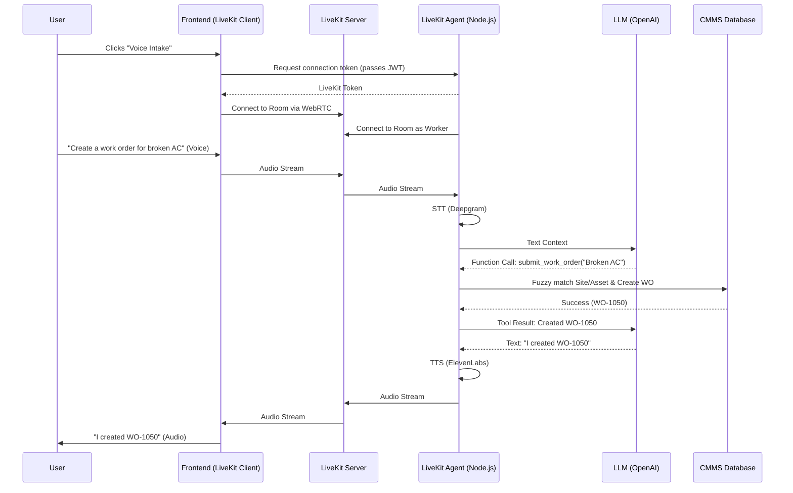

# LiveKit Voice AI Agent Implementation Plan for CMMS Work Order Creation

## 1. Executive Summary
This document outlines the architecture, design, and step-by-step implementation plan for integrating a **LiveKit-based Voice AI Agent** into the existing CMMS backend. Unlike general-purpose agents, this specific agent is highly specialized: its **only** responsibility is talking to users to create work orders.

By utilizing LiveKit's open-source WebRTC infrastructure and LiveKit Agents framework, we achieve ultra-low latency, real-time audio streaming, and deep integration with our existing Node.js/Express backend.

## 2. Target Use Case

### Work Order Creation (Voice Intake)
*   **Scenario:** A technician or staff member encounters an issue (e.g., "The HVAC in Building A is leaking").
*   **Action:** They initiate a voice session with the LiveKit agent via the web or mobile app.
*   **Flow:**
    1.  Agent asks what the issue is.
    2.  User describes the issue.
    3.  Agent extracts necessary fields (Title, Priority, Site, Asset, Assignee).
    4.  Agent fuzzy-matches Sites and Assets using backend tools.
    5.  Agent confirms details with the user.
    6.  Agent creates the work order.

## 3. Technology Stack

*   **Voice Orchestrator:** **LiveKit Cloud** (or self-hosted LiveKit Server). Handles WebRTC, audio/video routing, and connection management.
*   **Agent Framework:** **LiveKit Agents** (Node.js/TypeScript). Connects to LiveKit rooms, processes audio via STT/TTS, and orchestrates the LLM.
*   **LLM Engine:** OpenAI `gpt-4o` or Anthropic `claude-3.5-sonnet` (via LiveKit Agents plugins).
*   **STT (Speech-to-Text):** Deepgram or OpenAI Whisper (via LiveKit plugins).
*   **TTS (Text-to-Speech):** ElevenLabs or OpenAI TTS (via LiveKit plugins).
*   **Backend Integration:** Existing Express.js/Node.js CMMS backend.

## 4. Architectural Flow



## 5. Security & Authentication Strategy

Since the agent is tightly coupled with our backend and runs as a Node.js process alongside it (or as a separate microservice), we handle authentication during the LiveKit token generation phase.

### In-App Voice (Browser/Mobile App)
1.  The frontend already has a valid JWT token.
2.  Frontend makes a `POST /api/voice-agent/token` request to our backend, passing the JWT.
3.  Our `auth.ts` middleware authenticates the request.
4.  The backend generates a secure LiveKit connection token, embedding the user's `id`, `org_id`, and `site_id` into the token's `metadata`.
5.  When the LiveKit Agent worker connects to the room, it reads this `metadata` to know exactly who is speaking and scopes all database queries accordingly.

## 6. System Prompt Configuration

The LLM driving the LiveKit Agent must be strictly constrained to its single responsibility.

**Prompt Template:**
> You are the automated Maintenance Intake Agent for the CMMS platform. Your ONLY responsibility is to create work orders efficiently by talking to users. 
> You are speaking to technicians, managers, and staff over a voice interface. Keep your responses extremely concise, conversational, and completely free of technical jargon or database terms.
> 
> # Goal
> Collect enough information from the user to submit a complete Work Order.
> Required fields to collect:
> 1. Issue Summary (Title & Description)
> 2. Priority Level (Map user urgency to: 'low', 'medium', 'high', 'critical')
> Optional fields:
> 3. Location / Site Name (If the user works across multiple sites)
> 4. Asset or Equipment Name (e.g., "The main HVAC unit")
> 5. Assigned Person (e.g., "Assign it to John")
> 
> # Conversation Flow Rules
> 1. Greet the user briefly: "Maintenance intake. What do you need to report?"
> 2. Extract the issue. If the user only gives a vague issue (e.g., "It's broken"), ask for the specific equipment or location.
> 3. Infer the priority automatically based on the issue (e.g., "Fire" = critical, "Squeaky door" = low). If unsure, assume 'medium' or ask the user.
> 4. DO NOT ask for all fields at once. Ask a maximum of ONE question at a time.
> 5. CONFIRMATION: Once you have the Issue and Location/Equipment, summarize it briefly and ask for confirmation: "Got it. I'm creating a high-priority ticket for the broken HVAC in Building A. Should I submit this?"
> 6. EXECUTION: Once confirmed, call the `submit_work_order` tool.
> 
> # Handling Tool Responses
> - If the tool returns a success message with a Work Order Number, tell the user: "Done. Ticket WO-1024 has been created." and ask if they need anything else.
> - If the tool returns `needs_clarification`, it means the backend found multiple matches for the equipment or site (e.g., "We have 3 HVAC units in Building A"). Read the options provided by the tool to the user and ask them to specify.

## 7. Backend Implementation Steps

### Step 1: Install LiveKit Dependencies
Add the required SDKs to the Node.js backend:
`npm install livekit-server-sdk @livekit/agents @livekit/agents-plugin-openai @livekit/agents-plugin-deepgram @livekit/agents-plugin-elevenlabs`

### Step 2: Create Token Generation Endpoint
Create an endpoint for the authenticated frontend to request a LiveKit room token.
*   **Path:** `src/routes/voiceAgent.routes.ts`
*   **Controller Logic:** Generates an AccessToken using `livekit-server-sdk`, appending `req.user.id` and `req.user.org_id` to the participant metadata.

### Step 3: Implement the LiveKit Agent Worker
Create a dedicated worker process or integrate it into the existing Express app startup.
*   **Path:** `src/agents/workOrderAgent.ts`
*   **Logic:** 
    *   Initialize the `Worker` from `@livekit/agents`.
    *   Set up the STT (Speech-to-Text), TTS (Text-to-Speech), and LLM (Language Model) pipelines.
    *   Bind the system prompt defined in Section 6.

### Step 4: Implement the `submit_work_order` Tool
This is the core function the LLM will call. It lives inside the LiveKit Agent context and communicates directly with the CMMS database/services.

#### Tool Definition
```typescript
import { tool } from '@livekit/agents';
import { z } from 'zod';

const SubmitWorkOrderTool = {
  name: 'submit_work_order',
  description: 'Submits the collected work order details to the database.',
  parameters: z.object({
    title: z.string().describe('A short, 3-7 word summary of the issue.'),
    description: z.string().optional().describe('Detailed explanation of the problem.'),
    priority: z.enum(['low', 'medium', 'high', 'critical']).describe('The inferred urgency.'),
    site_name: z.string().optional().describe('The name of the facility or site.'),
    asset_name: z.string().optional().describe('The name or tag of the equipment.'),
    assignee_name: z.string().optional().describe('The first or last name of the assignee.'),
  }),
  execute: async (args, context) => {
     // Implementation logic here
  }
};
```

#### Tool Execution Logic (Fuzzy Matching + Creation)
1.  **Extract Context:** Read `org_id` and `user_id` from the LiveKit room/participant metadata.
2.  **Resolve Site:**
    *   If user has a fixed `site_id`, use it.
    *   If `site_name` is provided, do a fuzzy search (`LIKE %name%`) on the `Sites` table.
3.  **Resolve Asset:**
    *   If `asset_name` is provided, do a fuzzy search on `Assets` within the resolved `site_id`.
    *   *Clarification Logic:* If multiple assets match (e.g., "AC"), return a structured string back to the LLM: `"needs_clarification: I found multiple matches: AC-1, AC-2, AC-3. Ask the user which one."`
4.  **Create Work Order:**
    *   Map the resolved IDs to `CreateWorkOrderDTO`.
    *   Call `workOrderService.create()`.
    *   Return success string to LLM: `"success: Created Work Order WO-1052"`.

## 8. Rollout Plan

1.  **Phase 1: Infrastructure & Testing**
    *   Set up LiveKit Cloud project and API keys.
    *   Implement the token generation endpoint.
    *   Build a simple React frontend component using `@livekit/components-react` to test audio connectivity.
2.  **Phase 2: Agent Development**
    *   Write the LiveKit Agent worker script.
    *   Configure OpenAI, Deepgram, and ElevenLabs plugins.
    *   Test the conversational flow in a sandbox environment without database writes.
3.  **Phase 3: Database Integration**
    *   Implement the `submit_work_order` tool logic with fuzzy matching against the real CMMS database.
    *   Test end-to-end creation, including the clarification ping-pong (e.g., handling duplicate asset names).
4.  **Phase 4: Production Deployment**
    *   Deploy the Agent worker as a robust process (e.g., Docker container managed by PM2 or Kubernetes).
    *   Integrate the Voice UI button into the main frontend application for technicians.