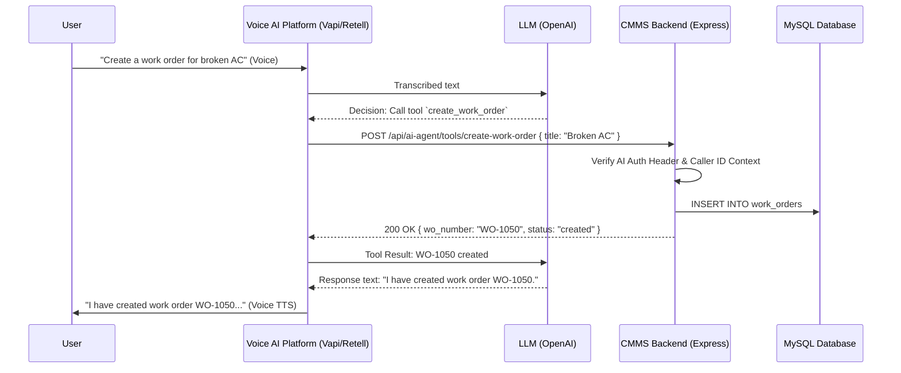

# Voice AI Agent Implementation Plan for CMMS Platform

## 1. Executive Summary
This document outlines the architecture, design, and step-by-step implementation plan for integrating a **Voice AI Agent** into the existing CMMS backend. The goal is to allow technicians and managers to interact with the platform hands-free using natural language via phone calls or an in-app voice interface.

## 2. Target Use Cases for Voice Automation

### For Technicians (Field Workers)
*   **Querying:** "What are my assigned work orders for today?"
*   **Creation:** "Create a high-priority work order. The HVAC in Building A is leaking."
*   **Status Updates:** "Mark work order WO-1024 as In Progress."
*   **Inventory Logging:** "I used 2 air filters on work order WO-1024, please update the inventory."
*   **Adding Notes:** "Add a comment to my current work order that the parts are ordered and we are waiting for delivery."

### For Managers
*   **Status Checks:** "What is the status of the forklift repair?"
*   **Reassignment:** "Assign work order WO-1025 to John Smith."
*   **Metrics:** "How many critical work orders are currently open?"

---

## 3. Recommended Technology Stack
To minimize latency and development time, we recommend using a specialized Voice AI orchestration platform that handles Speech-to-Text (STT), LLM processing, and Text-to-Speech (TTS) seamlessly.

*   **Voice Orchestrator:** **Vapi.ai** or **Retell AI**. These platforms handle the WebRTC (for browser) or SIP/Telephony (for phone calls) and allow you to configure custom "Tools" (API webhooks).
*   **LLM Engine:** OpenAI `gpt-4o` or Anthropic `claude-3.5-sonnet` (configured within Vapi/Retell).
*   **Backend Integration:** Existing Express.js/Node.js backend. We will create dedicated `/api/ai-agent/` routes that the Voice Orchestrator will call when the AI decides to use a tool.

---

## 4. Architectural Flow



---

## 5. Security & Authentication Strategy

Since the AI agent will perform actions on behalf of a user, authentication is critical. 

### Scenario A: Phone Call (Telephony)
1.  **Caller ID Matching:** When a user calls the Twilio/Vapi phone number, the Voice Platform sends the caller's phone number to our backend.
2.  **User Lookup:** The backend looks up the `User` table by `phone` number to determine the `user_id` and `org_id`.
3.  **Fallback (PIN Code):** If the phone number is not recognized, the AI prompts the user: "Please say your 4-digit PIN." The AI passes the PIN to a `/api/ai-agent/verify-pin` tool to authenticate.

### Scenario B: In-App Voice (Browser Microphone)
1.  The frontend already has a valid JWT token.
2.  When initializing the Vapi/Retell web client, the frontend passes the JWT token as a custom header or context variable.
3.  When the Voice Platform calls our backend tools, it forwards this JWT token.
4.  Our existing `auth.ts` middleware authenticates the request exactly like a normal API call.

---

## 6. Backend Implementation Steps

### Step 1: Create AI Agent Routes & Controllers
Create a new isolated routing module for the AI to ensure we don't accidentally expose internal APIs.

*   **Path:** `src/routes/aiAgent.ts`
*   **Path:** `src/controllers/aiAgent.controller.ts`

### Step 2: Implement Tool Endpoint Handlers
The AI will send JSON payloads based on the schema we define. We need handlers for these specific tools:

1.  **`POST /api/ai-agent/tools/get-my-work-orders`**
    *   *Input:* `status` (optional, e.g., 'open')
    *   *Logic:* Look up user context, call `WorkOrderRepository.findAll({ assignee_id: user.id })`.
    *   *Output:* JSON list of concise work order summaries (WO Number, Title, Status).
2.  **`POST /api/ai-agent/tools/create-work-order`**
    *   *Input:* `title`, `description`, `priority`
    *   *Logic:* Call `WorkOrderService.createWorkOrder(orgId, userId, payload)`.
3.  **`POST /api/ai-agent/tools/update-work-order-status`**
    *   *Input:* `wo_number`, `status`
    *   *Logic:* Find WO by number, call `WorkOrderService.updateStatus()`.
4.  **`POST /api/ai-agent/tools/log-inventory-usage`**
    *   *Input:* `wo_number`, `item_name` (or SKU), `quantity`
    *   *Logic:* Search for the inventory item using `LIKE %item_name%`. If multiple matches, return an error asking the AI to clarify. If exact match, call `WorkOrderService.addInventoryUsage()`.

### Step 3: Implement Webhook Security Middleware
The requests from Vapi/Retell need to be authenticated to ensure malicious actors don't hit the `/api/ai-agent/` endpoints directly.

*   Create `src/middleware/aiAuth.ts`.
*   Validate a shared secret (`AI_WEBHOOK_SECRET` in `.env`) sent by the Voice Platform in the headers.

### Step 4: System Prompt Configuration
In the Voice AI platform dashboard (e.g., Vapi), configure the System Prompt.

**Example Prompt:**
> "You are an AI Maintenance Assistant for a CMMS platform. You help technicians and managers manage their work orders and inventory. Always be concise. Before creating or modifying a work order, confirm the details with the user. If you need to log inventory, ensure you have the work order number and the exact item name. Use the provided tools to fetch and mutate data."

---

## 7. Data Structure Example (Tool Call)

### Tool Schema Definition (Configured in Vapi/OpenAI)
```json
{
  "name": "create_work_order",
  "description": "Creates a new maintenance work order in the CMMS.",
  "parameters": {
    "type": "object",
    "properties": {
      "title": { "type": "string", "description": "Short summary of the issue" },
      "description": { "type": "string", "description": "Detailed description" },
      "priority": { "type": "string", "enum": ["low", "medium", "high", "critical"] }
    },
    "required": ["title", "priority"]
  }
}
```

### Backend Controller Handling (`aiAgent.controller.ts`)
```typescript
import { Request, Response } from 'express';
import { WorkOrderService } from '../services/workOrder.service';
import { AppError } from '../errors/AppError';

export const handleCreateWorkOrder = async (req: Request, res: Response) => {
    // req.user is populated either via forwarded JWT or Caller ID mapping
    const { org_id, id: user_id } = req.user; 
    const { title, description, priority } = req.body;

    try {
        const workOrderService = new WorkOrderService();
        const newWo = await workOrderService.createWorkOrder(org_id, user_id, {
            title,
            description,
            priority,
            requester_id: user_id, // User talking to AI is the requester
            status: 'new'
        });

        // Return clear, concise JSON for the LLM to read aloud
        res.status(200).json({
            success: true,
            message: `Work order created successfully with ID ${newWo.wo_number}`,
            wo_number: newWo.wo_number
        });
    } catch (error) {
        res.status(400).json({ 
            success: false, 
            error: error instanceof AppError ? error.message : 'Internal error occurred' 
        });
    }
};
```

---

## 8. Rollout Plan

1.  **Phase 1: Read-Only Web Agent**
    *   Integrate Vapi Web SDK into the frontend.
    *   Implement read-only tools: `get-my-work-orders`, `get-work-order-status`.
    *   Test AI comprehension of asset names and technical jargon.
2.  **Phase 2: Mutation Web Agent**
    *   Implement state-changing tools: `create-work-order`, `update-status`.
    *   Test edge cases (e.g., trying to close a WO without required fields).
3.  **Phase 3: Telephony Integration**
    *   Purchase a Twilio phone number and attach it to Vapi.
    *   Implement Caller-ID to `User` matching logic in the backend.
    *   Deploy to field technicians for hands-free driving/working capabilities.