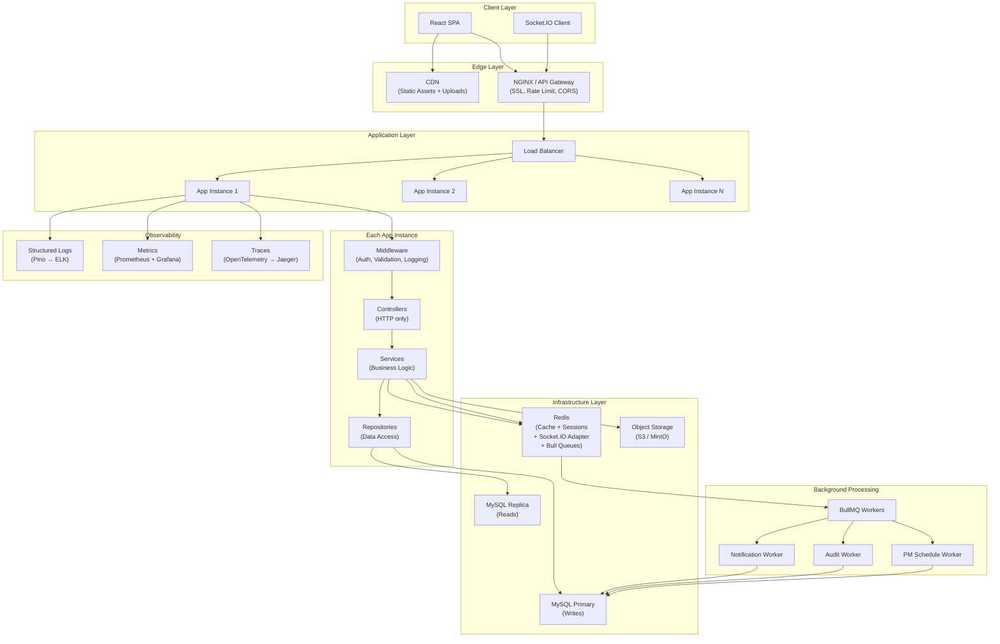
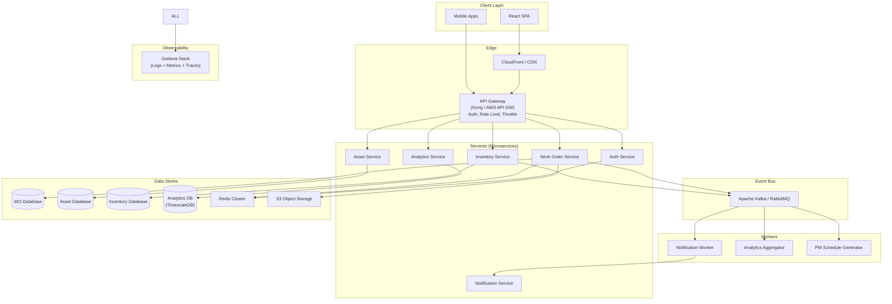

# Enterprise Architecture Improvement Plan

> **System**: CMMS-Platform Backend  
> **Date**: March 2026  
> **Prerequisite**: [architecture-review.md](file:///Users/sidpd57/Documents/Spartans/CMMS-Platform/backend/architecture-review.md)  
> **Goal**: Transform from prototype to production-grade enterprise system

---

## 1. Structural Improvements

### 1.1 Extract a Service Layer (Priority: P0)

**Current state**: All business logic lives inside Express route handlers (controllers). `workOrders.ts` is 578 lines mixing HTTP concerns, business rules, notification dispatch, and audit logging.

**Proposed structure**:

```
src/
├── controllers/          # HTTP request/response handling ONLY
│   ├── auth.controller.ts
│   ├── users.controller.ts
│   ├── workOrders.controller.ts
│   └── ...
├── services/             # Business logic, orchestration
│   ├── auth.service.ts
│   ├── user.service.ts
│   ├── workOrder.service.ts
│   ├── notification.service.ts
│   ├── audit.service.ts
│   └── inventory.service.ts
├── repositories/         # Data access abstraction
│   ├── user.repository.ts
│   ├── workOrder.repository.ts
│   └── ...
├── validators/           # Input validation schemas
│   ├── auth.validator.ts
│   ├── workOrder.validator.ts
│   └── ...
├── middleware/
├── models/
├── config/
└── server.ts
```

**Why this matters**:
- **Testability**: Services can be unit-tested without spinning up Express or a database
- **Reusability**: The same `WorkOrderService.create()` can be called from REST, WebSocket, or a background job
- **Separation of concerns**: Controllers handle HTTP, services handle logic, repositories handle data
- **Team scaling**: Different developers can work on different layers without merge conflicts

**Example refactor** — Before (current):

```typescript
// routes/workOrders.ts — 578 lines, mixed concerns
router.post('/:wo_id/comments', async (req: any, res, next) => {
    // 60+ lines of: validate WO, create comment, load relations,
    // emit socket, determine recipients, create notifications...
});
```

**After (proposed)**:

```typescript
// controllers/workOrders.controller.ts
async createComment(req: AuthRequest, res: Response, next: NextFunction) {
    const comment = await this.workOrderService.addComment(
        req.params.wo_id, req.user, req.body.message
    );
    res.status(201).json(comment);
}

// services/workOrder.service.ts
async addComment(woId: string, user: User, message: string): Promise<WOComment> {
    const wo = await this.woRepo.findByIdAndOrg(woId, user.org_id);
    if (!wo) throw new AppError('Work order not found', 404);

    const comment = await this.commentRepo.create({ work_order_id: woId, user_id: user.id, message });
    const fullComment = await this.commentRepo.findWithUser(comment.id);

    // Fire-and-forget: notification is async, non-blocking
    this.notificationService.notifyCommentAdded(wo, user, fullComment);

    return fullComment;
}
```

### 1.2 Split Model Definitions (Priority: P2)

**Current state**: All 12 models in one `models/index.ts` file (232 lines).

**Proposed**:

```
src/models/
├── index.ts                # Re-exports + association setup
├── Organization.model.ts
├── User.model.ts
├── Role.model.ts
├── Asset.model.ts
├── WorkOrder.model.ts
├── PMSchedule.model.ts
├── InventoryItem.model.ts
├── WOComment.model.ts
├── Notification.model.ts
├── WorkOrderInventoryItem.model.ts
├── WOAttachment.model.ts
├── AuditLog.model.ts
└── associations.ts         # All association definitions
```

**Why**: Each model is independently maintainable, reviewable, and discoverable. Associations are centralized to prevent circular dependency issues.

### 1.3 Centralize Audit Logging (Priority: P1)

**Current state**: Every route handler manually constructs and inserts audit log entries (~15 duplicated blocks across the codebase).

**Proposed**: Create an `AuditService` with a Sequelize hook or middleware pattern:

```typescript
// services/audit.service.ts
class AuditService {
    async log(params: {
        orgId: string;
        userId: string;
        userEmail: string;
        entityType: string;
        entityId: string;
        action: AuditAction;
        oldValues?: object;
        newValues?: object;
    }): Promise<void> {
        // Fire-and-forget: don't let audit failure break business operations
        AuditLog.create(params).catch(err => logger.error('Audit log failed', err));
    }
}
```

**Why**: Eliminates 15+ duplicated code blocks, ensures consistent audit format, and decouples audit logging from business flows.

### 1.4 Consolidate RBAC Role Definitions (Priority: P1)

**Current state**: Role names are hardcoded in mixed case across every route:

```typescript
requireRole(['Super_Admin', 'Org_Admin', 'Admin', 'super_admin', 'org_admin', 'admin'])
```

**Proposed**:

```typescript
// constants/roles.ts
export const ROLES = {
    SUPER_ADMIN: 'super_admin',
    ORG_ADMIN: 'org_admin',
    FACILITY_MANAGER: 'facility_manager',
    TECHNICIAN: 'technician',
    REQUESTOR: 'requestor',
} as const;

export const ADMIN_ROLES = [ROLES.SUPER_ADMIN, ROLES.ORG_ADMIN];
export const MANAGER_ROLES = [...ADMIN_ROLES, ROLES.FACILITY_MANAGER];

// Middleware should normalize to lowercase on comparison
```

**Why**: Single source of truth, case-insensitive comparison in middleware, no more mixed-case duplication.

---

## 2. Scalability Improvements

### 2.1 Asynchronous Background Processing (Priority: P0)

**Problem**: Notification delivery, audit logging, and analytics computation are synchronous within request flows.

**Solution**: Introduce a task queue for non-critical operations.

| Technology | When to Use |
|---|---|
| **BullMQ + Redis** | Ideal for this scale. Lightweight, Node.js native, supports retries, delays, priorities |
| **RabbitMQ** | When multiple consumer services need to process the same events |
| **AWS SQS** | When running on AWS and want managed infrastructure |

**What to move to background jobs**:

| Job | Current Location | Priority |
|---|---|---|
| Notification creation + Socket.IO emit | `workOrders.ts` (comment handler) | P0 |
| Audit log creation | All route handlers | P1 |
| Email notifications (future) | N/A | P1 |
| Analytics pre-computation | `analytics.ts` | P2 |
| PM schedule → WO auto-generation | Not implemented yet | P2 |

**Example with BullMQ**:

```typescript
// jobs/notification.job.ts
const notificationQueue = new Queue('notifications', { connection: redis });

// In service code (non-blocking):
await notificationQueue.add('comment-notification', {
    workOrderId: wo.id,
    commenterId: user.id,
    commentId: comment.id,
});

// Worker (separate process or thread):
const worker = new Worker('notifications', async (job) => {
    const { workOrderId, commenterId, commentId } = job.data;
    // Create notifications, emit Socket.IO events
}, { connection: redis });
```

### 2.2 Distributed Caching with Redis (Priority: P1)

**What to cache and for how long**:

| Data | TTL | Cache Key Pattern | Invalidation |
|---|---|---|---|
| User session / profile | 15 min | `user:{id}` | On user update |
| Role list per org | 1 hour | `roles:{org_id}` | On role create/update |
| Analytics dashboard | 2 min | `analytics:dashboard:{org_id}` | On WO status change |
| Inventory categories | 1 hour | `inv:categories:{org_id}` | On item create |
| Inventory stats | 5 min | `inv:stats:{org_id}` | On stock change |

**Estimated impact**: Analytics dashboard response time drops from ~500ms (10+ queries) to ~5ms (cache hit). Under typical usage patterns, 80%+ of dashboard requests would be cache hits.

### 2.3 Database Query Optimization (Priority: P0)

**Replace N+1 analytics queries**:

```typescript
// BEFORE: 12 individual COUNT queries
for (const status of WO_STATUSES) {
    const count = await WorkOrder.count({ where: { org_id, status } });
    woByStatus.push({ status, count });
}

// AFTER: 1 GROUP BY query
const woByStatus = await WorkOrder.findAll({
    attributes: ['status', [fn('COUNT', col('id')), 'count']],
    where: { org_id: orgId },
    group: ['status'],
    raw: true,
});
```

**Replace in-memory inventory valuation**:

```typescript
// BEFORE: Fetch ALL items, reduce in JavaScript (OOM risk)
const allItems = await InventoryItem.findAll({ where: { org_id } });
const total_value = allItems.reduce(...);

// AFTER: DB-level aggregation
const [result] = await sequelize.query(
    `SELECT SUM(quantity * CAST(unit_cost AS DECIMAL(10,2))) AS total_value
     FROM inventory_items WHERE org_id = ? AND is_active = true`,
    { replacements: [org_id], type: QueryTypes.SELECT }
);
```

### 2.4 Database Read Replicas (Priority: P2 — at 10K+ users)

Route read-heavy queries (list, search, analytics) to read replicas:

```typescript
const sequelize = new Sequelize({
    replication: {
        read: [
            { host: 'replica1.db.internal', username: 'reader', password: '...' },
            { host: 'replica2.db.internal', username: 'reader', password: '...' },
        ],
        write: { host: 'primary.db.internal', username: 'writer', password: '...' },
    },
    // Sequelize automatically routes SELECT to read, INSERT/UPDATE/DELETE to write
});
```

---

## 3. Infrastructure Improvements

### 3.1 API Gateway (Priority: P1)

Deploy an API gateway (NGINX, Kong, or AWS API Gateway) in front of Express:

**Responsibilities**:
- SSL/TLS termination
- Rate limiting (per IP, per authenticated user)
- Request logging and tracing headers
- CORS enforcement
- Load balancing across multiple app instances
- Static file serving (`/uploads/` offloaded from Express)

### 3.2 Containerization (Priority: P0)

```dockerfile
# Dockerfile
FROM node:20-alpine AS builder
WORKDIR /app
COPY package*.json ./
RUN npm ci --only=production
COPY . .
RUN npm run build

FROM node:20-alpine
WORKDIR /app
COPY --from=builder /app/dist ./dist
COPY --from=builder /app/node_modules ./node_modules
COPY package.json ./
USER node
EXPOSE 8000
HEALTHCHECK --interval=30s CMD wget -qO- http://localhost:8000/health || exit 1
CMD ["node", "dist/server.js"]
```

**Why**: Reproducible builds, consistent environments, foundation for orchestration.

### 3.3 Kubernetes Orchestration (Priority: P2 — at scale)

```yaml
# k8s/deployment.yaml (simplified)
apiVersion: apps/v1
kind: Deployment
metadata:
  name: cmms-backend
spec:
  replicas: 3
  template:
    spec:
      containers:
      - name: cmms-backend
        image: cmms-backend:latest
        resources:
          requests: { memory: "256Mi", cpu: "250m" }
          limits: { memory: "512Mi", cpu: "500m" }
        readinessProbe:
          httpGet: { path: /health, port: 8000 }
        livenessProbe:
          httpGet: { path: /health, port: 8000 }
```

### 3.4 Object Storage for Uploads (Priority: P0)

Replace local file storage with cloud object storage:

```typescript
// Before: multer → local disk
const storage = multer.diskStorage({ destination: uploadDir });

// After: multer-s3 → S3/MinIO
import multerS3 from 'multer-s3';
import { S3Client } from '@aws-sdk/client-s3';

const s3 = new S3Client({ region: 'us-east-1' });
const upload = multer({
    storage: multerS3({
        s3,
        bucket: 'cmms-uploads',
        key: (req, file, cb) => cb(null, `work-orders/${Date.now()}-${file.originalname}`),
    }),
});
```

**Why**: Enables horizontal scaling, built-in redundancy, CDN integration. Use MinIO for on-premise/dev parity.

---

## 4. Reliability Improvements

### 4.1 Database Transactions (Priority: P0)

Wrap all multi-step operations in Sequelize transactions:

```typescript
// services/inventory.service.ts
async consumePart(woId: string, itemId: string, qty: number, orgId: string): Promise<WorkOrderInventoryItem> {
    return sequelize.transaction(async (t) => {
        // Lock the row to prevent concurrent overselling
        const item = await InventoryItem.findOne({
            where: { id: itemId, org_id: orgId },
            lock: t.LOCK.UPDATE,  // SELECT ... FOR UPDATE
            transaction: t,
        });

        if (!item || item.quantity < qty) {
            throw new AppError(`Insufficient stock. Available: ${item?.quantity ?? 0}`, 400);
        }

        item.quantity -= qty;
        await item.save({ transaction: t });

        return WorkOrderInventoryItem.create({
            work_order_id: woId,
            inventory_item_id: itemId,
            quantity_used: qty,
        }, { transaction: t });
    });
}
```

### 4.2 Idempotency Keys (Priority: P1)

Prevent duplicate operations from network retries:

```typescript
// middleware/idempotency.ts
export const idempotent = () => async (req: Request, res: Response, next: NextFunction) => {
    const key = req.headers['idempotency-key'] as string;
    if (!key) return next();

    const cached = await redis.get(`idempotency:${key}`);
    if (cached) {
        const { statusCode, body } = JSON.parse(cached);
        return res.status(statusCode).json(body);
    }

    // Intercept res.json to cache the response
    const originalJson = res.json.bind(res);
    res.json = (body: any) => {
        redis.setex(`idempotency:${key}`, 86400, JSON.stringify({ statusCode: res.statusCode, body }));
        return originalJson(body);
    };

    next();
};
```

### 4.3 Graceful Shutdown (Priority: P0)

```typescript
// server.ts
const shutdown = async (signal: string) => {
    console.log(`Received ${signal}. Starting graceful shutdown...`);

    // 1. Stop accepting new connections
    httpServer.close(() => console.log('HTTP server closed'));

    // 2. Close Socket.IO connections
    io.close(() => console.log('Socket.IO closed'));

    // 3. Close database connection pool
    await sequelize.close();
    console.log('Database connections closed');

    process.exit(0);
};

process.on('SIGTERM', () => shutdown('SIGTERM'));
process.on('SIGINT', () => shutdown('SIGINT'));
```

### 4.4 Enhanced Health Check (Priority: P1)

```typescript
app.get('/health', async (req: Request, res: Response) => {
    const checks: Record<string, string> = {};

    try {
        await sequelize.authenticate();
        checks.database = 'ok';
    } catch {
        checks.database = 'error';
    }

    checks.uptime = `${Math.floor(process.uptime())}s`;
    checks.memory = `${Math.round(process.memoryUsage().heapUsed / 1024 / 1024)}MB`;

    const allOk = Object.values(checks).every(v => v !== 'error');
    res.status(allOk ? 200 : 503).json({ status: allOk ? 'ok' : 'degraded', checks });
});
```

### 4.5 Replace `sequelize.sync()` with Migrations (Priority: P0)

```bash
# Install Sequelize CLI
npm install --save-dev sequelize-cli

# Initialize migrations
npx sequelize-cli init

# Create migration from existing models
npx sequelize-cli migration:generate --name initial-schema

# Run migrations (production startup)
npx sequelize-cli db:migrate
```

**In `server.ts`**: Remove `sequelize.sync()` and replace with migration check or startup script.

---

## 5. Observability Improvements

### 5.1 Structured Logging with Pino (Priority: P0)

```typescript
// config/logger.ts
import pino from 'pino';

export const logger = pino({
    level: process.env.LOG_LEVEL || 'info',
    transport: process.env.NODE_ENV !== 'production'
        ? { target: 'pino-pretty' }
        : undefined,
    serializers: {
        req: pino.stdSerializers.req,
        res: pino.stdSerializers.res,
        err: pino.stdSerializers.err,
    },
});

// Replace all console.log → logger.info, console.error → logger.error
```

### 5.2 Request Correlation IDs (Priority: P1)

```typescript
// middleware/requestId.ts
import { randomUUID } from 'crypto';

export const requestId = () => (req: Request, res: Response, next: NextFunction) => {
    req.id = req.headers['x-request-id'] as string || randomUUID();
    res.setHeader('x-request-id', req.id);
    next();
};
```

### 5.3 Request Logging Middleware (Priority: P1)

```typescript
// middleware/requestLogger.ts
export const requestLogger = () => (req: Request, res: Response, next: NextFunction) => {
    const start = Date.now();
    res.on('finish', () => {
        logger.info({
            method: req.method,
            url: req.originalUrl,
            statusCode: res.statusCode,
            durationMs: Date.now() - start,
            requestId: req.id,
            userId: (req as any).user?.id,
            orgId: (req as any).user?.org_id,
        });
    });
    next();
};
```

### 5.4 Metrics with Prometheus (Priority: P2)

```typescript
import promClient from 'prom-client';

// Auto-collect default metrics (CPU, memory, event loop lag)
promClient.collectDefaultMetrics();

// Custom metrics
const httpRequestDuration = new promClient.Histogram({
    name: 'http_request_duration_seconds',
    help: 'Duration of HTTP requests',
    labelNames: ['method', 'route', 'status'],
    buckets: [0.01, 0.05, 0.1, 0.5, 1, 5],
});

// Metrics endpoint
app.get('/metrics', async (req, res) => {
    res.set('Content-Type', promClient.register.contentType);
    res.end(await promClient.register.metrics());
});
```

### 5.5 Distributed Tracing with OpenTelemetry (Priority: P3)

```typescript
// tracing.ts (loaded before all other imports)
import { NodeSDK } from '@opentelemetry/sdk-node';
import { OTLPTraceExporter } from '@opentelemetry/exporter-trace-otlp-grpc';
import { getNodeAutoInstrumentations } from '@opentelemetry/auto-instrumentations-node';

const sdk = new NodeSDK({
    traceExporter: new OTLPTraceExporter({ url: 'http://jaeger:4317' }),
    instrumentations: [getNodeAutoInstrumentations()],
    serviceName: 'cmms-backend',
});

sdk.start();
```

**This automatically instruments**: Express routes, Sequelize queries, HTTP outbound calls, and Socket.IO — with zero code changes.

---

## 6. Security Improvements

### 6.1 Input Validation with Zod (Priority: P0)

```typescript
// validators/workOrder.validator.ts
import { z } from 'zod';

export const CreateWorkOrderSchema = z.object({
    title: z.string().min(1).max(255),
    description: z.string().max(5000).optional(),
    asset_id: z.string().uuid().nullable().optional(),
    assignee_id: z.string().uuid().nullable().optional(),
    priority: z.enum(['low', 'medium', 'high', 'critical']).default('medium'),
    location: z.string().max(100).optional(),
    scheduled_start: z.string().datetime().optional(),
    scheduled_end: z.string().datetime().optional(),
    estimated_hours: z.number().int().positive().optional(),
}).strict(); // Rejects unexpected fields — prevents mass assignment

// middleware/validate.ts
export const validate = (schema: z.ZodSchema) => (req: Request, res: Response, next: NextFunction) => {
    const result = schema.safeParse(req.body);
    if (!result.success) {
        return res.status(400).json({
            detail: 'Validation failed',
            errors: result.error.flatten().fieldErrors,
        });
    }
    req.body = result.data; // Use only validated, whitelisted data
    next();
};
```

### 6.2 Rate Limiting (Priority: P0)

```typescript
import rateLimit from 'express-rate-limit';

// Global rate limit
app.use(rateLimit({
    windowMs: 15 * 60 * 1000, // 15 minutes
    max: 500,                  // 500 requests per window
    standardHeaders: true,
}));

// Strict limit on auth endpoints
const authLimiter = rateLimit({
    windowMs: 15 * 60 * 1000,
    max: 10,                   // 10 login attempts per 15 min
    message: { detail: 'Too many login attempts. Try again later.' },
});
app.use('/api/auth/login', authLimiter);
```

### 6.3 JWT Security Hardening (Priority: P1)

```typescript
// Remove hardcoded fallback secrets
const secret = process.env.JWT_SECRET;
if (!secret) {
    logger.fatal('JWT_SECRET environment variable is required');
    process.exit(1);
}

// Use RS256 for production (asymmetric keys)
const privateKey = fs.readFileSync('/secrets/jwt-private.pem');
const publicKey = fs.readFileSync('/secrets/jwt-public.pem');

// Sign with private key
const token = jwt.sign(payload, privateKey, { algorithm: 'RS256', expiresIn: '1h' });

// Verify with public key (can be distributed to other services)
const decoded = jwt.verify(token, publicKey, { algorithms: ['RS256'] });
```

### 6.4 Secrets Management (Priority: P1)

| Current | Improvement |
|---|---|
| `.env` file in repo | Use vault-based secrets (AWS Secrets Manager, HashiCorp Vault) |
| Hardcoded fallback secrets | Fail fast if secrets missing — no fallbacks |
| `JWT_SECRET=your_super_secret_jwt_key` | Generate strong 256-bit secrets via `openssl rand -hex 32` |
| `DB_PASSWORD=cmms_password` | Rotate credentials regularly; use IAM-based DB auth where possible |

### 6.5 Helmet Security Headers (Priority: P1)

```typescript
import helmet from 'helmet';
app.use(helmet()); // Adds X-Frame-Options, CSP, HSTS, etc.
```

### 6.6 Request Payload Size Limits (Priority: P1)

```typescript
app.use(express.json({ limit: '1mb' })); // Prevent large payload DoS
```

---

## 7. Improved Architecture Design

### 7.1 Target Architecture (Phase 1 — Production Ready)



### 7.2 Target Architecture (Phase 2 — Enterprise Scale)



---

## 8. Scaling Strategy

### From 10 Users → 10K Users → 1M Users

```mermaid
timeline
    title Scaling Roadmap
    section Phase 1 : 10 → 1K Users
        Service Layer Extraction : Separate controllers from business logic
        Database Transactions : Prevent race conditions, ensure data integrity
        Input Validation (Zod) : Prevent mass assignment and injection
        Rate Limiting : Protect auth endpoints
        Redis Caching : Cache analytics, roles, categories
        Object Storage (S3/MinIO) : Replace local file uploads
        Sequelize Migrations : Replace sequelize.sync()
        Structured Logging (Pino) : Replace console.log
        Docker Containerization : Reproducible deployments
        Graceful Shutdown : Zero-downtime deploys
    section Phase 2 : 1K → 10K Users
        BullMQ Background Jobs : Async notifications and audit logging
        Redis Socket.IO Adapter : Multi-instance WebSocket support
        MySQL Read Replicas : Separate read-heavy analytics queries
        Connection Pool Tuning : Optimize Sequelize pool settings
        API Gateway (NGINX/Kong) : SSL termination and load balancing
        Prometheus Metrics : Performance monitoring and alerting
        CI/CD Pipeline : Automated testing, build, and deploy
        Horizontal Scaling : 2-4 app instances behind load balancer
    section Phase 3 : 10K → 1M Users
        Microservice Extraction : Split WO, Asset, Inventory into services
        Event-Driven Architecture : Kafka/RabbitMQ for inter-service communication
        Database Per Service : Separate databases for each domain
        Kubernetes Orchestration : Auto-scaling and self-healing
        Analytics Dedicated Store : TimescaleDB or ClickHouse for analytics
        CDN for Uploads : CloudFront/Cloudflare for file delivery
        OpenTelemetry Tracing : Distributed tracing across services
        CQRS Pattern : Separate read/write models for high-traffic queries
```

### Detailed Scaling Table

| Component | 10 Users | 10K Users | 1M Users |
|---|---|---|---|
| **App Instances** | 1 | 2–4 | 10–50 (auto-scaled) |
| **Database** | Single MySQL | Primary + 2 read replicas | Sharded MySQL or Aurora Serverless |
| **Caching** | None → Redis single | Redis single | Redis Cluster (6+ nodes) |
| **File Storage** | Local disk | S3 single bucket | S3 + CloudFront CDN |
| **WebSockets** | In-memory | Redis adapter + 2 instances | Redis adapter + dedicated WS service |
| **Background Jobs** | Synchronous | BullMQ (1 worker) | BullMQ (auto-scaled workers) |
| **Search** | SQL LIKE | SQL LIKE + indexes | Elasticsearch / Meilisearch |
| **Analytics** | Direct SQL | Cached SQL + pre-computed | Dedicated analytics DB (CQRS) |
| **Logging** | Console | Pino → ELK | Pino → ELK (centralized) |
| **Monitoring** | None | Prometheus + Grafana | Full observability (Datadog/Grafana Cloud) |
| **CI/CD** | Manual | GitHub Actions | Multi-env pipeline with canary deploys |

---

## 9. Enterprise Production Checklist

### ✅ Infrastructure

| Item | Status | Priority | Notes |
|---|---|---|---|
| Dockerized application | ❌ Not done | P0 | Create multi-stage Dockerfile |
| Container orchestration (K8s) | ❌ Not done | P2 | After containerization |
| Load balancer | ❌ Not done | P1 | NGINX or cloud ALB |
| SSL/TLS termination | ❌ Not done | P0 | Required for any production deployment |
| Object storage for uploads | ❌ Not done | P0 | Replace local disk with S3/MinIO |
| Database migrations | ❌ Not done | P0 | Replace `sequelize.sync()` |
| Environment-based configuration | ⚠️ Partial | P1 | `.env` exists but has hardcoded fallbacks |
| Graceful shutdown | ❌ Not done | P0 | Handle SIGTERM for zero-downtime deploys |
| Resource limits (memory, CPU) | ❌ Not done | P1 | Set in Docker/K8s |
| CDN for static assets | ❌ Not done | P2 | CloudFront or Cloudflare |

### ✅ Security

| Item | Status | Priority | Notes |
|---|---|---|---|
| Input validation & sanitization | ❌ Not done | P0 | Add Zod schemas for all endpoints |
| Rate limiting | ❌ Not done | P0 | Especially on `/auth/login` |
| Security headers (Helmet) | ❌ Not done | P1 | Add `helmet()` middleware |
| Secrets management | ❌ Not done | P1 | Remove hardcoded fallback secrets |
| JWT algorithm hardening | ❌ Not done | P1 | Consider RS256 or short-lived tokens + refresh |
| CORS configuration | ⚠️ Partial | P1 | Currently allows all origins (`*`) |
| SQL injection protection | ✅ Done | — | Sequelize parameterizes queries |
| Password hashing | ✅ Done | — | bcryptjs with salt rounds = 10 |
| Role-based access control | ✅ Done | — | `requireRole()` middleware |
| Soft delete / data retention | ✅ Done | — | Paranoid mode on all models |
| Dependency vulnerability scanning | ❌ Not done | P1 | Add `npm audit` to CI |
| API key / service-to-service auth | ❌ Not done | P2 | For future microservices |

### ✅ Observability

| Item | Status | Priority | Notes |
|---|---|---|---|
| Structured logging | ❌ Not done | P0 | Replace `console.log` with Pino |
| Request correlation IDs | ❌ Not done | P1 | Add `x-request-id` middleware |
| Request/response logging | ❌ Not done | P1 | Log method, path, status, duration |
| Application metrics | ❌ Not done | P2 | Prometheus client |
| Distributed tracing | ❌ Not done | P3 | OpenTelemetry |
| Error tracking service | ❌ Not done | P1 | Sentry or similar |
| Alerting rules | ❌ Not done | P2 | Alert on error rate, latency, DB health |
| Log aggregation | ❌ Not done | P2 | ELK stack or CloudWatch |

### ✅ Reliability

| Item | Status | Priority | Notes |
|---|---|---|---|
| Database transactions | ❌ Not done | P0 | Critical for inventory, user ops |
| Idempotency keys | ❌ Not done | P1 | Prevent duplicate operations |
| Retry mechanisms | ❌ Not done | P2 | For DB transient failures |
| Circuit breakers | ❌ Not done | P3 | For external service calls (future) |
| Dead-letter queues | ❌ Not done | P2 | For failed async jobs |
| Data backups | ❌ Not done | P0 | Automated MySQL backups |
| Disaster recovery plan | ❌ Not done | P1 | RTO/RPO targets, runbooks |
| Deep health checks | ❌ Not done | P1 | Check DB, Redis, disk connectivity |
| Graceful degradation | ❌ Not done | P2 | Fallbacks when Redis/services are down |

### ✅ DevOps / CI-CD

| Item | Status | Priority | Notes |
|---|---|---|---|
| Automated test suite | ❌ Not done | P0 | Zero tests currently |
| CI pipeline (build + lint + test) | ❌ Not done | P0 | GitHub Actions or equivalent |
| CD pipeline (deploy) | ❌ Not done | P1 | Staging → Production promotion |
| Environment parity (dev/stage/prod) | ❌ Not done | P1 | Docker Compose for dev |
| Database migration CI step | ❌ Not done | P0 | Run migrations before deploy |
| Code coverage reporting | ❌ Not done | P2 | Target 80%+ on services |
| Dependency update automation | ❌ Not done | P2 | Renovate or Dependabot |
| Rollback strategy | ❌ Not done | P1 | Blue-green or canary deploys |

---

### Implementation Priority Summary

| Phase | Items | Timeline |
|---|---|---|
| **Phase 0 (Critical)** | DB transactions, input validation, rate limiting, replace `sequelize.sync()`, graceful shutdown, structured logging, SSL, Dockerfile | **Weeks 1–3** |
| **Phase 1 (High)** | Service layer extraction, Redis caching, object storage, health checks, Helmet, secrets, CI/CD pipeline, test suite | **Weeks 4–8** |
| **Phase 2 (Medium)** | Background jobs (BullMQ), Redis Socket.IO adapter, read replicas, API gateway, metrics, horizontal scaling | **Weeks 9–14** |
| **Phase 3 (Future)** | Microservice extraction, Kafka event bus, Kubernetes, OpenTelemetry, CQRS, database sharding | **Quarter 2+** |

---

> **Note for leadership**: The current architecture is appropriate for a prototype / early-development stage. The proposed improvements are industry-standard practices, not over-engineering. Each phase addresses specific risks identified in [architecture-review.md](file:///Users/sidpd57/Documents/Spartans/CMMS-Platform/backend/architecture-review.md) and directly improves system reliability, security, and team velocity.
